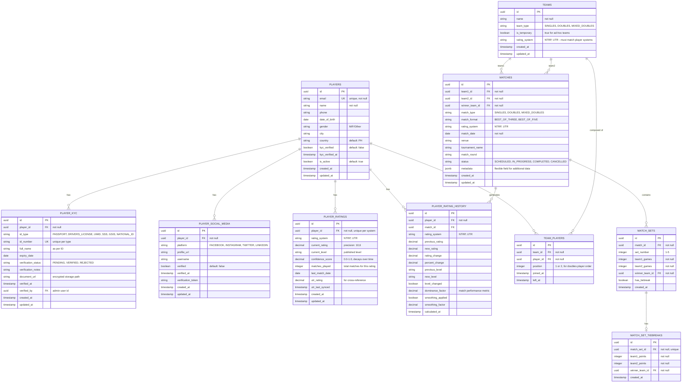

# Tennis Levelr Database Schema

This document describes the database schema for the Tennis Levelr MVP and future enhancements.

## Design Principles

1. **Team-Based Match Model**: Matches are between teams (not players directly) to support both singles and doubles
2. **Historical Rating Tracking**: All rating changes are preserved for audit and confidence calculations
3. **Future-Proof**: Schema supports upcoming features (doubles, social verification, UTR integration)
4. **Philippine-Specific KYC**: Built-in support for Philippine government ID validation

## Entity Relationship Diagram



## Table Descriptions

### Core Tables

#### `PLAYERS`
Stores player profile information.

**Key Fields:**
- `email`: Unique identifier for authentication
- `kyc_verified`: Whether Philippine government ID has been verified
- `is_active`: Soft delete flag

**Indexes:**
- Primary: `id`
- Unique: `email`
- Index: `created_at`, `is_active`

---

#### `PLAYER_KYC`
Philippine-specific government ID verification.

**Supported ID Types:**
- `PASSPORT`: Philippine Passport
- `DRIVERS_LICENSE`: LTO Driver's License
- `UMID`: Unified Multi-Purpose ID
- `SSS`: Social Security System ID
- `GSIS`: Government Service Insurance System ID
- `NATIONAL_ID`: Philippine National ID (PhilSys)

**Verification Workflow:**
1. Player uploads ID document → `PENDING`
2. Admin reviews → `VERIFIED` or `REJECTED`
3. `players.kyc_verified` flag updated on verification

**Indexes:**
- Primary: `id`
- Foreign: `player_id`
- Unique: `(id_type, id_number)` - prevent duplicate IDs
- Index: `verification_status`

---

#### `PLAYER_SOCIAL_MEDIA`
Social media account verification for additional identity confirmation.

**Supported Platforms:**
- Facebook, Instagram, Twitter (X), LinkedIn

**Future Enhancement:**
- Automated verification via OAuth tokens
- Social graph analysis for fraud detection

**Indexes:**
- Primary: `id`
- Foreign: `player_id`
- Unique: `(player_id, platform)` - one account per platform

---

#### `PLAYER_RATINGS`
Current rating state for each player in each rating system.

**Key Features:**
- One record per player per rating system (NTRP/UTR)
- `confidence_score`: Decays over time based on `last_match_date`
- `utr_rating`: Cached UTR value for cross-validation

**Confidence Score Algorithm:**
```
confidence = 1.0 - (days_since_last_match / 365)
confidence = max(0.0, confidence)
```

**Indexes:**
- Primary: `id`
- Foreign: `player_id`
- Unique: `(player_id, rating_system)`
- Index: `last_match_date` (for confidence calculation)

---

#### `PLAYER_RATING_HISTORY`
Immutable audit trail of all rating changes.

**Purpose:**
- Historical analysis and reporting
- Rating confidence calculations
- Dispute resolution
- Algorithm tuning

**Key Fields:**
- `dominance_factor`: Match performance metric from calculator
- `smoothing_applied`: Whether USTA-style smoothing was used
- `calculated_at`: Timestamp of calculation (not match date)

**Indexes:**
- Primary: `id`
- Foreign: `player_id`, `match_id`
- Index: `(player_id, calculated_at)` - for player rating history queries
- Index: `rating_system` - for system-specific reports

---

### Match Structure

#### `TEAMS`
Represents match participants (singles or doubles teams).

**Team Types:**
- `SINGLES`: 1 player (current MVP)
- `DOUBLES`: 2 players (same gender)
- `MIXED_DOUBLES`: 2 players (male + female)

**Temporary vs Permanent:**
- `is_temporary = true`: Ad-hoc team for a single match
- `is_temporary = false`: Established doubles partnership

**Constraints:**
- SINGLES teams must have exactly 1 player
- DOUBLES/MIXED_DOUBLES teams must have exactly 2 players
- All players in a team must use the same rating system

**Indexes:**
- Primary: `id`
- Index: `team_type`, `is_temporary`

---

#### `TEAM_PLAYERS`
Junction table for team membership.

**Key Fields:**
- `position`: For doubles, indicates player order (1 = primary, 2 = secondary)
- `left_at`: Supports team roster changes over time

**Constraints:**
- Current active members: `left_at IS NULL`
- Historical tracking: `left_at IS NOT NULL`

**Indexes:**
- Primary: `id`
- Foreign: `team_id`, `player_id`
- Unique: `(team_id, player_id, joined_at)` - prevent duplicate memberships
- Index: `left_at IS NULL` - for current team rosters

---

#### `MATCHES`
Match records between two teams.

**Key Fields:**
- `match_type`: Must match team types
- `rating_system`: All participants must use this system
- `status`: Workflow support (future: live scoring)
- `metadata`: JSON field for extensibility (e.g., court number, weather conditions)

**Business Rules:**
- `team1_id != team2_id`
- `winner_team_id IN (team1_id, team2_id)`
- Both teams must use the same rating system

**Indexes:**
- Primary: `id`
- Foreign: `team1_id`, `team2_id`, `winner_team_id`
- Index: `match_date`, `status`, `rating_system`
- Index: `(team1_id, match_date)`, `(team2_id, match_date)` - for player match history

---

#### `MATCH_SETS`
Set-by-set scoring.

**Validation Rules:**
- Winner must have 6+ games
- Must win by 2 games (except tiebreak sets)
- Tiebreak sets: 7-6 or 6-7 only

**Indexes:**
- Primary: `id`
- Foreign: `match_id`, `winner_team_id`
- Index: `(match_id, set_number)` - for set ordering

---

#### `MATCH_SET_TIEBREAKS`
Optional tiebreak details.

**Validation Rules:**
- Winner must have 7+ points
- Must win by 2 points

**Indexes:**
- Primary: `id`
- Foreign: `match_set_id` (unique - one tiebreak per set)
- Foreign: `winner_team_id`

---

## Data Integrity Constraints

### Foreign Key Constraints

```sql
-- Player relationships
ALTER TABLE player_kyc ADD CONSTRAINT fk_player_kyc_player
    FOREIGN KEY (player_id) REFERENCES players(id) ON DELETE CASCADE;

ALTER TABLE player_social_media ADD CONSTRAINT fk_player_social_player
    FOREIGN KEY (player_id) REFERENCES players(id) ON DELETE CASCADE;

ALTER TABLE player_ratings ADD CONSTRAINT fk_player_ratings_player
    FOREIGN KEY (player_id) REFERENCES players(id) ON DELETE CASCADE;

ALTER TABLE player_rating_history ADD CONSTRAINT fk_rating_history_player
    FOREIGN KEY (player_id) REFERENCES players(id) ON DELETE CASCADE;

ALTER TABLE player_rating_history ADD CONSTRAINT fk_rating_history_match
    FOREIGN KEY (match_id) REFERENCES matches(id) ON DELETE SET NULL;

-- Team relationships
ALTER TABLE team_players ADD CONSTRAINT fk_team_players_team
    FOREIGN KEY (team_id) REFERENCES teams(id) ON DELETE CASCADE;

ALTER TABLE team_players ADD CONSTRAINT fk_team_players_player
    FOREIGN KEY (player_id) REFERENCES players(id) ON DELETE CASCADE;

-- Match relationships
ALTER TABLE matches ADD CONSTRAINT fk_matches_team1
    FOREIGN KEY (team1_id) REFERENCES teams(id) ON DELETE RESTRICT;

ALTER TABLE matches ADD CONSTRAINT fk_matches_team2
    FOREIGN KEY (team2_id) REFERENCES teams(id) ON DELETE RESTRICT;

ALTER TABLE matches ADD CONSTRAINT fk_matches_winner
    FOREIGN KEY (winner_team_id) REFERENCES teams(id) ON DELETE RESTRICT;

ALTER TABLE match_sets ADD CONSTRAINT fk_match_sets_match
    FOREIGN KEY (match_id) REFERENCES matches(id) ON DELETE CASCADE;

ALTER TABLE match_sets ADD CONSTRAINT fk_match_sets_winner
    FOREIGN KEY (winner_team_id) REFERENCES teams(id) ON DELETE RESTRICT;

ALTER TABLE match_set_tiebreaks ADD CONSTRAINT fk_tiebreaks_set
    FOREIGN KEY (match_set_id) REFERENCES match_sets(id) ON DELETE CASCADE;

ALTER TABLE match_set_tiebreaks ADD CONSTRAINT fk_tiebreaks_winner
    FOREIGN KEY (winner_team_id) REFERENCES teams(id) ON DELETE RESTRICT;
```

### Check Constraints

```sql
-- Player validation
ALTER TABLE players ADD CONSTRAINT chk_players_email
    CHECK (email ~* '^[A-Za-z0-9._%+-]+@[A-Za-z0-9.-]+\.[A-Za-z]{2,}$');

ALTER TABLE players ADD CONSTRAINT chk_players_gender
    CHECK (gender IN ('M', 'F', 'Other'));

-- KYC validation
ALTER TABLE player_kyc ADD CONSTRAINT chk_kyc_id_type
    CHECK (id_type IN ('PASSPORT', 'DRIVERS_LICENSE', 'UMID', 'SSS', 'GSIS', 'NATIONAL_ID'));

ALTER TABLE player_kyc ADD CONSTRAINT chk_kyc_status
    CHECK (verification_status IN ('PENDING', 'VERIFIED', 'REJECTED'));

-- Social media validation
ALTER TABLE player_social_media ADD CONSTRAINT chk_social_platform
    CHECK (platform IN ('FACEBOOK', 'INSTAGRAM', 'TWITTER', 'LINKEDIN'));

-- Rating validation
ALTER TABLE player_ratings ADD CONSTRAINT chk_rating_system
    CHECK (rating_system IN ('NTRP', 'UTR'));

ALTER TABLE player_ratings ADD CONSTRAINT chk_rating_range_ntrp
    CHECK (rating_system != 'NTRP' OR (current_rating >= 1.0 AND current_rating <= 7.0));

ALTER TABLE player_ratings ADD CONSTRAINT chk_rating_range_utr
    CHECK (rating_system != 'UTR' OR (current_rating >= 1.0 AND current_rating <= 16.0));

ALTER TABLE player_ratings ADD CONSTRAINT chk_confidence_range
    CHECK (confidence_score >= 0.0 AND confidence_score <= 1.0);

-- Team validation
ALTER TABLE teams ADD CONSTRAINT chk_team_type
    CHECK (team_type IN ('SINGLES', 'DOUBLES', 'MIXED_DOUBLES'));

ALTER TABLE team_players ADD CONSTRAINT chk_team_position
    CHECK (position IN (1, 2));

-- Match validation
ALTER TABLE matches ADD CONSTRAINT chk_match_type
    CHECK (match_type IN ('SINGLES', 'DOUBLES', 'MIXED_DOUBLES'));

ALTER TABLE matches ADD CONSTRAINT chk_match_format
    CHECK (match_format IN ('BEST_OF_THREE', 'BEST_OF_FIVE'));

ALTER TABLE matches ADD CONSTRAINT chk_match_status
    CHECK (status IN ('SCHEDULED', 'IN_PROGRESS', 'COMPLETED', 'CANCELLED'));

ALTER TABLE matches ADD CONSTRAINT chk_match_teams_different
    CHECK (team1_id != team2_id);

-- Set validation
ALTER TABLE match_sets ADD CONSTRAINT chk_set_number
    CHECK (set_number BETWEEN 1 AND 5);

ALTER TABLE match_sets ADD CONSTRAINT chk_set_games_positive
    CHECK (team1_games >= 0 AND team2_games >= 0);

-- Tiebreak validation
ALTER TABLE match_set_tiebreaks ADD CONSTRAINT chk_tiebreak_points_positive
    CHECK (team1_points >= 0 AND team2_points >= 0);
```

---

## Future Enhancements

### Seeding Generation (Feature #10)
**Required Changes:**
- Add `seeding_rank` to `players` table (calculated field)
- Create `TOURNAMENTS` table
- Create `TOURNAMENT_DRAWS` table with seeding positions

### UTR Integration (Feature #12)
**Required Changes:**
- Add `utr_player_id` to `players` table
- Add `utr_last_synced` timestamp
- Create scheduled job to sync UTR ratings

### Dynamic Rating Confidence (Feature #14)
**Already Supported:**
- `player_ratings.confidence_score` field exists
- `player_ratings.last_match_date` for decay calculation
- `player_rating_history` for trend analysis

### Match Statistics (Future)
**Potential Tables:**
- `MATCH_STATISTICS`: Aces, double faults, winners, unforced errors
- `POINT_BY_POINT`: Granular point tracking for analytics

---

## Migration Strategy

### Phase 1: Core Tables (MVP)
1. `players`
2. `player_kyc`
3. `teams`
4. `team_players`
5. `matches`
6. `match_sets`
7. `match_set_tiebreaks`
8. `player_ratings`
9. `player_rating_history`

### Phase 2: Enhanced Features
10. `player_social_media`
11. Add UTR integration fields
12. Add confidence scoring

### Phase 3: Tournament Management
13. `tournaments`
14. `tournament_draws`
15. `seeding_ranks`

---

## Sample Queries

### Get Player's Current Ratings
```sql
SELECT
    p.name,
    pr.rating_system,
    pr.current_rating,
    pr.current_level,
    pr.confidence_score,
    pr.matches_played,
    pr.last_match_date,
    CASE
        WHEN pr.last_match_date > CURRENT_DATE - INTERVAL '30 days' THEN 'Active'
        WHEN pr.last_match_date > CURRENT_DATE - INTERVAL '90 days' THEN 'Moderate'
        ELSE 'Inactive'
    END as activity_status
FROM players p
JOIN player_ratings pr ON p.id = pr.player_id
WHERE p.email = 'player@example.com';
```

### Get Player's Match History
```sql
SELECT
    m.match_date,
    t1.name as team1_name,
    t2.name as team2_name,
    CASE WHEN m.winner_team_id = t1.id THEN t1.name ELSE t2.name END as winner,
    STRING_AGG(
        ms.team1_games || '-' || ms.team2_games,
        ', ' ORDER BY ms.set_number
    ) as score,
    prh.rating_change,
    prh.new_rating
FROM matches m
JOIN teams t1 ON m.team1_id = t1.id
JOIN teams t2 ON m.team2_id = t2.id
JOIN match_sets ms ON m.id = ms.match_id
JOIN team_players tp ON tp.team_id IN (t1.id, t2.id)
JOIN player_rating_history prh ON prh.match_id = m.id AND prh.player_id = tp.player_id
WHERE tp.player_id = '<player-uuid>'
    AND tp.left_at IS NULL
GROUP BY m.id, m.match_date, t1.name, t2.name, m.winner_team_id, prh.rating_change, prh.new_rating
ORDER BY m.match_date DESC;
```

### Get Top-Ranked Players (Seeding List)
```sql
SELECT
    p.name,
    pr.current_rating,
    pr.current_level,
    pr.matches_played,
    pr.confidence_score,
    pr.last_match_date,
    ROW_NUMBER() OVER (ORDER BY pr.current_rating DESC, pr.confidence_score DESC) as seed
FROM players p
JOIN player_ratings pr ON p.id = pr.player_id
WHERE pr.rating_system = 'NTRP'
    AND p.is_active = true
    AND pr.last_match_date > CURRENT_DATE - INTERVAL '180 days'
ORDER BY pr.current_rating DESC, pr.confidence_score DESC
LIMIT 64;
```

### Calculate Rating Confidence Decay
```sql
UPDATE player_ratings
SET confidence_score = GREATEST(
    0.0,
    1.0 - (EXTRACT(EPOCH FROM (CURRENT_DATE - last_match_date)) / (365.0 * 86400.0))
)
WHERE last_match_date < CURRENT_DATE;
```

---

## Technology Recommendations

### Database Engine
**PostgreSQL 15+**
- Native UUID support
- JSON/JSONB for flexible metadata
- Advanced indexing (GiST, GIN)
- Excellent performance for complex queries
- ACID compliance for rating calculations

### ORM Options
**For Kotlin:**
- **Exposed** (JetBrains) - Type-safe SQL DSL
- **jOOQ** - SQL-first, code generation
- **Hibernate/JPA** - Traditional ORM

### Connection Pooling
- **HikariCP** - Fast, reliable connection pooling

### Migration Tool
- **Flyway** - Version-controlled database migrations
- **Liquibase** - Alternative with more features

---

## Next Steps

1. **Review & Approve** this schema design
2. **Set up PostgreSQL** database instance
3. **Create Flyway migrations** for Phase 1 tables
4. **Implement data access layer** with Exposed or jOOQ
5. **Create repository interfaces** for each entity
6. **Write integration tests** for data access layer
7. **Implement API endpoints** for CRUD operations
