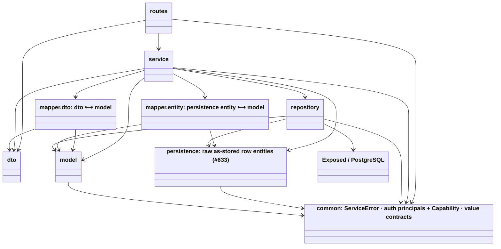
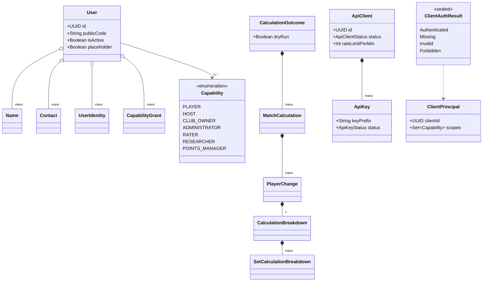
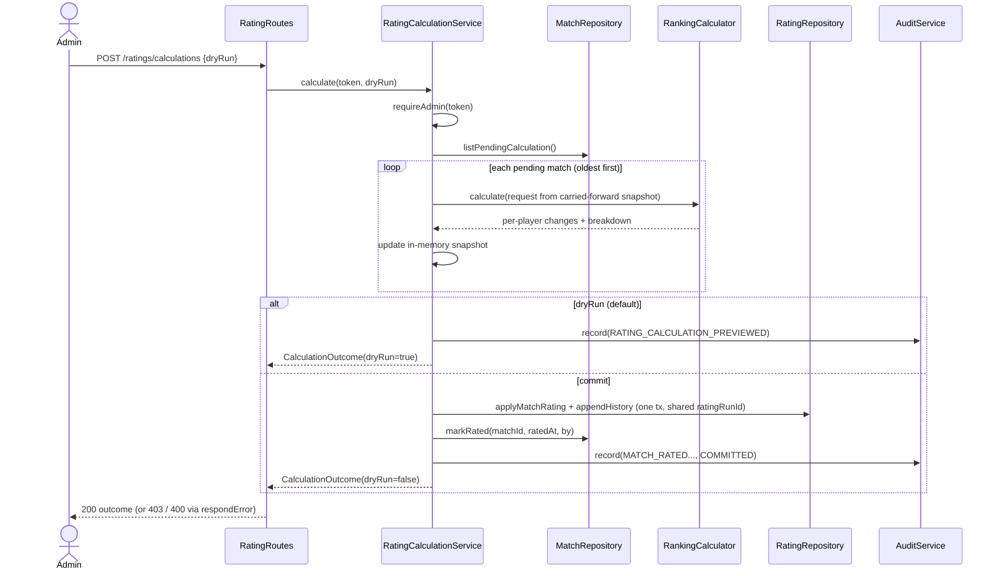
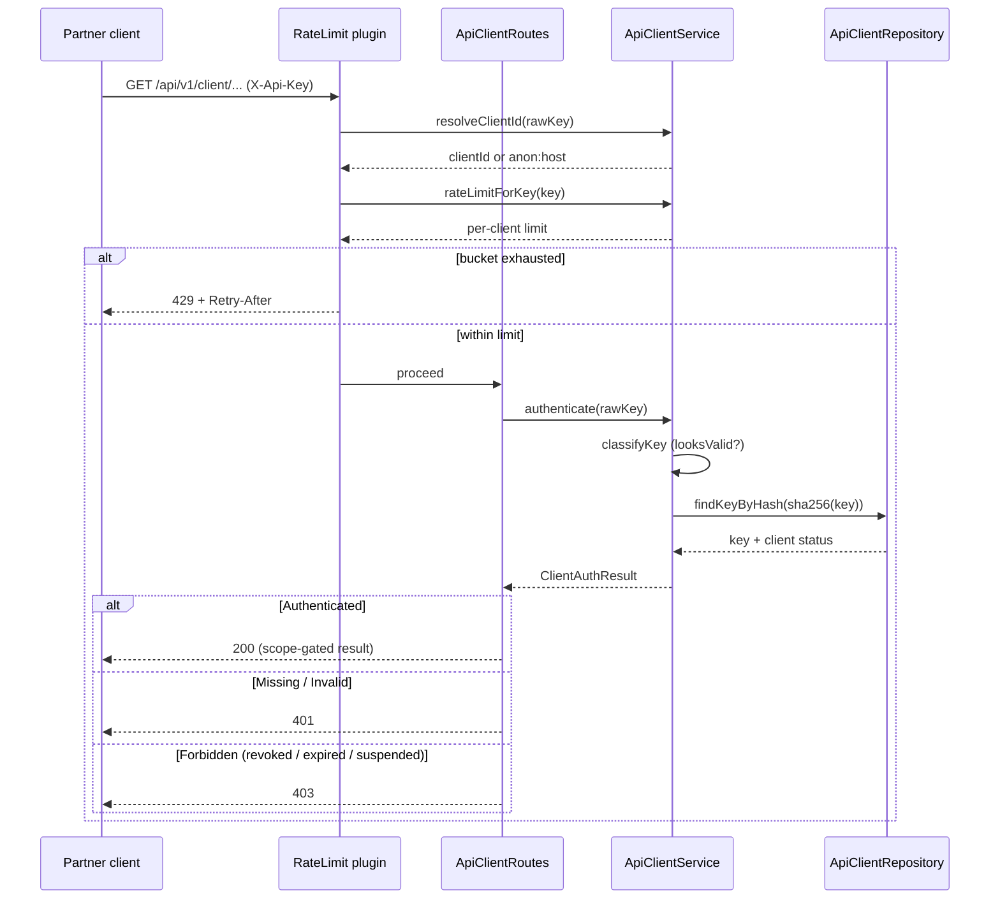

# Backend (API server) Architecture

How the Skopeo Ktor API is put together: how a request flows through the module, the layers it
crosses, how failures become HTTP statuses, and the two identities (end-user and partner
application) that can be on a request. Companion docs go deeper on specific slices — see
[AUTHENTICATION](./AUTHENTICATION.md), [CLIENT_API_AUTH](./CLIENT_API_AUTH.md),
[LAYERED_ARCHITECTURE](./LAYERED_ARCHITECTURE.md), [AUDIT_TRAIL](./AUDIT_TRAIL.md), and
[database-schema](./database-schema.md).

## TL;DR

- A single **Ktor** application (`Application.kt`) wired once in `Application.module()`; Netty engine,
  kotlinx.serialization JSON.
- **Layered**: `routes → service → repository → Exposed/PostgreSQL`, over a pure `model` layer and a raw
  `persistence` entity layer (#633: repositories map rows through dumb `<X>Entity` types, then convert to
  `model` at one boundary). The directions are enforced by `LayeredArchitectureTest` (ArchUnit).
- **Two identities**: end users authenticate with a **Firebase ID token** (verified against Google's
  JWKS); partner applications authenticate with a **hashed API key** (`X-Api-Key`). Authorization is
  in-house — capability roles for users, scopes for clients.
- **Expected failures are values, not exceptions**: services return Arrow `Either<ServiceError, T>`;
  the route layer is the single place that maps a `ServiceError` to an HTTP status.
- Persistence is only ever touched through `repository/` (Exposed `*Table` objects). The stateless
  `POST /api/v1/calculate-ranking` calculator is the one endpoint that persists nothing.

## Module wiring — `Application.module()`

`src/main/kotlin/org/skopeo/Application.kt`. `module(initDatabase, firebaseAuth, partnerRateLimit)`
is the composition root and runs, in order:

1. **`DatabaseConfig.init()`** — HikariCP pool + Flyway migrate + Exposed `Database.connect` (skipped
   when `initDatabase = false`, so integration tests can run without a live DB init); registers an
   `ApplicationStopped` hook to close the pool.
2. **`configureMonitoring()`** — `CallLogging` (INFO, custom format) + `MicrometerMetrics` →
   `PrometheusMeterRegistry`, exposing `GET /metrics`.
3. **`configurePlugins()`** — `ContentNegotiation { json() }` (kotlinx.serialization).
4. **`configureCORS()`** — always allows the Vite dev origin (`localhost:5173`) plus the
   comma-separated `cors.origins` / `WEB_ORIGINS`; methods GET/POST/PUT/PATCH/DELETE/OPTIONS; allowed
   headers `Content-Type` + `Authorization`; `allowCredentials` is off (token auth, not cookies). CORS
   is browser hygiene, **not** a security boundary.
5. **`configureSecurity(firebaseAuth)`** — installs the Firebase JWT auth provider (see below).
6. **`configureRateLimit(partnerRateLimit)`** — the per-client `"partner"` token-bucket tier.
7. **`configureOpenAPI()`** — serves `/openapi.yaml` + Swagger UI at `/swagger`, gated by the
   `docs.exposed` flag (env `DOCS_EXPOSED`, default on).
8. **`configureRouting()`** — infra routes: `GET /` and `GET /health` (reports the build version).
9. **~26 `configure*Routes()`** registrations (the feature route groups; see the catalog).

### Security plugin — `Security.kt`

`configureSecurity(settings: FirebaseAuthSettings?)` installs `Authentication { jwt(FIREBASE_AUTH) }`.
It verifies **Firebase RS256 ID tokens** against Google's public keys (`FIREBASE_JWK_URL`, a cached +
rate-limited `JwkProvider`): issuer `https://securetoken.google.com/<projectId>`, audience
`<projectId>` (from `firebase.projectId` / `FIREBASE_PROJECT_ID`). A valid token yields a
`JWTPrincipal`; the challenge returns a JSON `401`. `FirebaseAuthSettings` is injectable so tests mint
+ verify tokens offline. The route layer lifts the principal into a `VerifiedFirebaseToken` via
`verifiedToken()` — the only place that touches the raw JWT shape.

### Rate limiting — `configureRateLimit()`

One named token bucket, `PARTNER_RATE_LIMIT_NAME` (`DEFAULT_PARTNER_RATE_LIMIT = 120`/min). The bucket
key is the resolved client id behind `X-Api-Key` (`ApiClientService.resolveClientId`), falling back to
`anon:<remoteHost>`; the per-request limit is the client's override or the default
(`ApiClientService.rateLimitForKey`). Applied only to the partner routes (`/api/v1/client/**` and the
delegated `/api/v1/api-clients` reads). See [CLIENT_API_AUTH](./CLIENT_API_AUTH.md).

## Route-group catalog

All under `/api/v1` unless noted. Each is a `configure*Routes()` extension registered in `module()`.

| Group | Base path(s) | File |
|---|---|---|
| Ranking calculator (stateless) | `POST /calculate-ranking` | `RankingRoutes.kt` |
| Users | `/users`, `/users/{userId}`, `/users/me/*`, `/users/pending-assessment` | `UserRoutes.kt` |
| Placeholders / claim | `/users/placeholders`, `/users/claim` | `PlaceholderRoutes.kt` |
| Players (public by code) | `/players/{code}/*` | `PlayerRoutes.kt` |
| Contacts | `/users/{userId}/contacts` | `ContactRoutes.kt` |
| Names | `/users/{userId}/names` | `NameRoutes.kt` |
| Capabilities | `/users/{userId}/capabilities` | `CapabilityRoutes.kt` |
| Ratings | `/users/{id}/ratings`, `/users/{id}/rating-history`, `POST /ratings/calculations` | `RatingRoutes.kt` |
| Rating requests | `/rating-requests` | `RatingRequestRoutes.kt` |
| Matches | `/matches` | `MatchRoutes.kt` |
| Events | `/events` | `EventRoutes.kt` |
| Clubs | `/clubs` (+ public `/clubs/code/{code}`) | `ClubRoutes.kt` |
| API clients / keys | `/api-clients` (admin), `/client` (partner) | `ApiClientRoutes.kt` |
| Circuits | `/circuits` | `CircuitRoutes.kt` |
| Points config | `/settings/points/open-play`, `/settings/points/tournament` | `PointsConfigRoutes.kt` |
| Invites | `/invites` | `InviteRoutes.kt` |
| Duplicate candidates | `/duplicate-candidates` | `DuplicateCandidateRoutes.kt` |
| Player lists / seeding | `/player-lists` | `PlayerListRoutes.kt` |
| Standings | `/standings`, `/standings/me` | `StandingsRoutes.kt` |
| Standings calculation | `POST /standings/calculations` | `StandingsCalculationRoutes.kt` |
| Standings source | `/settings/standings-source` | `StandingsSourceRoutes.kt` |
| Ranking points | `/ranking-points`, `/users/{userId}/ranking-points` | `RankingPointRoutes.kt` |
| Audit log | `/audit` | `AuditRoutes.kt` |
| Reports | `/reports` | `ReportRoutes.kt` |
| Theme (global + per-user) | `/theme`, `/users/me/theme` | `ThemeRoutes.kt` |
| Open Graph (link previews) | `/og/*` | `OpenGraphRoutes.kt` |

Public reads use `authenticate(FIREBASE_AUTH, optional = true)` (a token is used if present, not
required); everything else is `authenticate(FIREBASE_AUTH)`.

## Layers

The layering is enforced by `LayeredArchitectureTest` (ArchUnit) — see
[LAYERED_ARCHITECTURE](./LAYERED_ARCHITECTURE.md). In short: `model`, `persistence`, and `common` are
leaf foundations (they depend up on nothing above). **`repository` is pure data-access**: it maps DB rows
to raw **`persistence`** entities and **returns those entities** — it no longer builds domain models. The
**`service`** layer is the orchestrator (and transport-agnostic — never imports `routes`): it calls a
repository, converts the returned entity to a domain `model` via a **`mapper.entity`** mapper, runs
business logic on the domain model, then converts that to a response DTO via a **`mapper.dto`** mapper.
There are therefore **two mapper packages, both consumed only by `service`**: `mapper.dto` owns the
dto↔model translation (`toResponse`/`toCommand`), `mapper.entity` owns the entity↔model translation
(`<X>Entity.toDomain(...)`). `dto` is a **pure serializable boundary record** (no `model`/`service`
dependency — save a small allowlist of three v1 stateless-calculator DTOs). Routes hand services the
**raw** query/path/body strings — services parse + validate them (bad enum/band/value →
`ServiceError.Validation` → 400). So **`routes` depend only on `service` + `dto`** plus the neutral
cross-cutting **`common`** package — `common.error` (`ServiceError`), `common.security` (auth principals
`ClientPrincipal`/`ClientAuthResult` + the `Capability` enum), and `common.contract` (`@Serializable`
value types shared across the wire + persistence, e.g. the points-config schedules) — and **never on
`mapper` or `model`**, enforced by a strict `routes ↛ model` rule with no exception. `common` is a true
foundation: **any** layer — including `model`, which references `Capability` — may depend on it, and it
depends on nothing above, not even `model`.

`common` (`org.skopeo.common.{error,security,contract}` — each a distinct sub-package with its own scope,
under one parent) is the sanctioned **cross-cutting foundation** of dependency-free shared value types:
`ServiceError`, the auth principals + the `Capability` enum, and the serializable points-config
contracts. **Every** layer — including `model` (which references `Capability`) — may depend on `common`;
`common` depends on nothing above it, not even `model`. Note there is **no `routes → model` edge**.

`persistence` (`org.skopeo.persistence`) is the **raw entity / data-model** leaf introduced by the #633
split: one dumb `<X>Entity` per aggregate that mirrors a DB row **as stored** — enum columns held as raw
`String`, JSON columns as the raw text, no derived fields and no behaviour (contrast the domain `model`
types, which carry derivations like `User.photoUrl` and `UserRating.confidence` and the assembled child
collections). A `repository` maps `ResultRow → <X>Entity` (assembling child rows into an entity **graph**
where an aggregate has children — only the repository can query) and **returns the entity**. The
`entity → domain` conversion lives in **`mapper.entity`** (`<X>Entity.toDomain(...)`), where derived
fields are computed and children attached — `mapper.entity` is the one place allowed to depend on **both**
`persistence` and `model`. It cannot live anywhere else: `persistence` is a strict leaf (depends only on
`common`; **`model` may not depend on `persistence`**), and `repository ↛ mapper` is enforced, so the
repository can't call it either. The **`service`** layer owns the round-trip: `repository.findX():
<X>Entity` → `mapper.entity.toDomain()` → domain → business logic → `mapper.dto` → DTO (so a service
transiently holds the entity to hand it to the mapper; there is no `service ↛ persistence` rule).
Derivations that need data outside the aggregate's own row are supplied by a service-layer assembler:
e.g. `UserRating.confidence` needs the player's windowed match rows, so **`RatingAssembler`** (service
layer) fetches them from `MatchRepository` and passes them to `UserRatingEntity.toDomain(windowed, now)`
— since the mapper can't run queries.
The two config repositories (`AppSettings`/`PointsConfig`) are the trivial case: a settings row is a bare
key/value with no domain counterpart, so their entities are used by their services directly with no
`mapper.entity` step.

## Error handling & the result convention

Services and repositories return **`Either<ServiceError, T>`** for *expected* failures (issue #115);
truly exceptional faults (bugs, IO) are still thrown and surface as `500`. `ServiceError`
(`common/error/ServiceError.kt`, package `org.skopeo.common.error`) is a sealed, HTTP-free taxonomy. The route layer is the single place that
maps it, via helpers in `routes/RouteSupport.kt`:

- `verifiedToken()` / `optionalVerifiedToken()` — lift the `JWTPrincipal` to a `VerifiedFirebaseToken`.
- `uuidParam(name)` — parse a UUID path param (bad input → `400`); enum/value parsing now happens
  service-side (services take the raw string and return `ServiceError.Validation`).
- `respondEither(result) { onSuccess }` — fold: left → `respondError`, right → write the success body.
- `respondError(error)` — the one `ServiceError → HTTP` switch (logs every failure at WARN).
- `respondMappingErrors { ... }` — wraps a handler so malformed JSON / DTO-`init` validation / parse
  errors map to `400` and anything else to `500`.

| `ServiceError` | HTTP |
|---|---|
| `Validation` | 400 |
| `Forbidden`, `AccountMerged`, `AccountDeleted` | 403 |
| `NotFound` | 404 |
| `Conflict` | 409 |

## Domain model (selected)

Pure Kotlin in `model/*Domain.kt` — no framework dependencies. The `User` aggregate is the hub;
per-request calculation results and the client-identity types are the other shapes worth seeing.

## Sequence: rating-calculation trigger (dry-run vs commit)

`POST /api/v1/ratings/calculations` → `RatingCalculationService.calculate(token, dryRun, eventIds?)`.
Dry-run is the default; only `{"dryRun": false}` writes. See
[RATING_CALCULATION_ALGORITHM](../../product/RATING_CALCULATION_ALGORITHM.md) for the math.

## Sequence: partner API-key auth + rate limit

A partner request carries `X-Api-Key`. Rate-limit keying runs before the handler; the handler then
resolves the key to a `ClientPrincipal`. See [CLIENT_API_AUTH](./CLIENT_API_AUTH.md).

## Where things live

| Concern | Location |
|---|---|
| Module wiring, plugins | `Application.kt` |
| Firebase JWT auth | `Security.kt` |
| Route helpers, error mapping | `routes/RouteSupport.kt` |
| Feature transport | `routes/*.kt` |
| Business logic | `service/**` |
| Persistence (Exposed) | `repository/*Table*.kt`, `repository/*Repository.kt` |
| Raw as-stored row entities (#633) | `persistence/*Entity.kt` |
| Pure domain + enums | `model/*Domain.kt` |
| HTTP request/response records | `dto/**` |
| dto↔model translation (`toResponse`/`toCommand`) | `mapper/**` |
| DB connection + migrations | `config/DatabaseConfig.kt`, `src/main/resources/db/migration/` |
