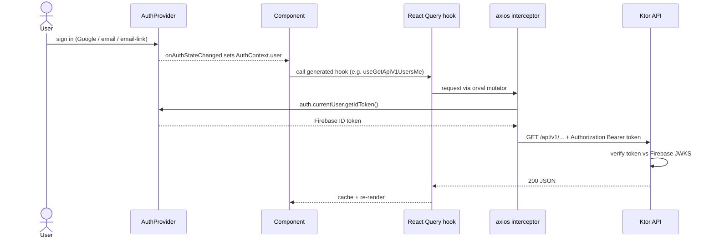
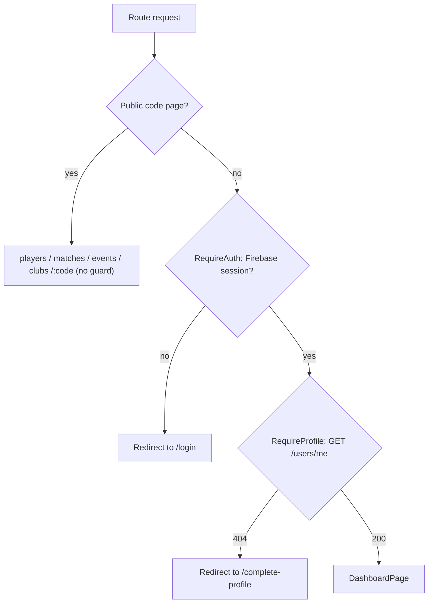
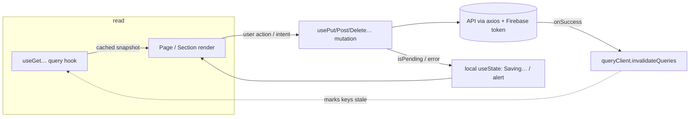
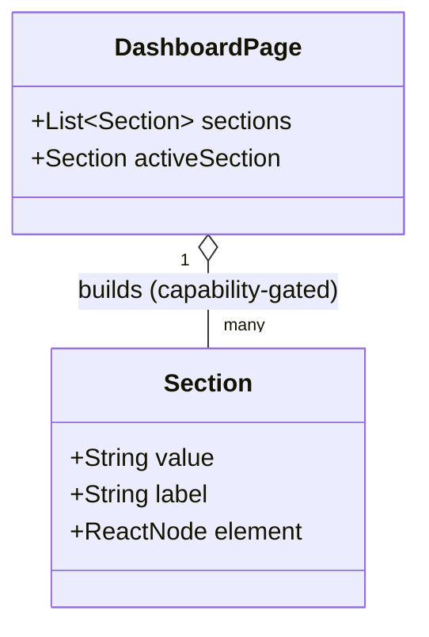
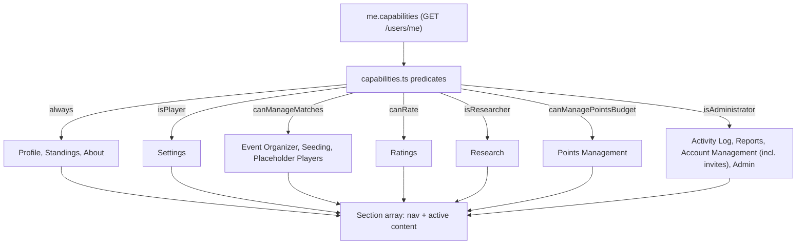

# Web UI architecture

The Skopeo web client (`web/`) is a single-page React application that is a pure client of the
Ktor JSON API. It is a separate deployable — built with Vite and served as static files from
Firebase Hosting — that talks to the backend over HTTP/JSON with Firebase-issued bearer tokens.
This document describes what exists today.

## Stack

| Concern | Choice |
|---|---|
| Framework / language | React 19 + TypeScript, bundled by Vite |
| Routing | React Router (`react-router-dom`) |
| Data layer | TanStack Query (`@tanstack/react-query`) |
| API client | Generated by **orval** from the backend OpenAPI spec (`react-query` + `axios`) |
| Auth | Firebase Authentication (`firebase`) |
| Styling / components | Tailwind CSS v4 (`@tailwindcss/vite`) + shadcn/ui-style components on Radix primitives (`@radix-ui/*`, `class-variance-authority`, `clsx`, `tailwind-merge`, `lucide-react` icons) |
| QR codes | `qrcode.react` (used by `ShareCard`) |
| Tests | Vitest + Testing Library (jsdom) |

Source lives under `web/src`; the `@` import alias maps to `web/src` (see `vite.config.ts`).
Entry is `src/main.tsx` → `src/App.tsx`, which composes the `QueryClientProvider`, `AuthProvider`,
and `BrowserRouter`.

## Authentication model

Firebase Auth is the identity provider; the Ktor API is the security boundary and verifies every
request's token against Firebase's JWKS (see [AUTHENTICATION.md](./AUTHENTICATION.md)).

- **Sign-up** (`/signup`, `SignUpPage.tsx`): email/password or Google/Facebook popup. **Sex
  (Male/Female) and date of birth are required up front** — they are collected before the OAuth
  popup since the popup yields neither — then the app calls `POST /api/v1/users` to provision the
  Skopeo profile from the verified Firebase token.
- **Login** (`/login`, `LoginPage.tsx`): existing credentials or OAuth. Login never provisions.
- **Profile completion** (`/complete-profile`, `CompleteProfilePage.tsx`): a user can be
  Firebase-authenticated but unprovisioned (signed in via OAuth on the login page, or provisioning
  failed). `RequireProfile` detects this — `GET /api/v1/users/me` returns 404 — and redirects here
  to capture the required sex + date of birth and create the profile.
- **Invites** (`/invite`, `InviteAcceptPage.tsx`): email-link sign-in for invited users; the
  continue URL carries the invitee's email so the accept page can complete the flow and set a
  password.

**How the token reaches the API:** `AuthProvider` (`src/auth/AuthProvider.tsx`) wraps the Firebase
SDK and exposes the auth state. A single axios instance (`src/api/axios.ts`, wired as orval's
`mutator`) attaches the current user's Firebase ID token as `Authorization: Bearer <token>` on
every generated request. Tokens are never persisted by the app — the SDK manages refresh.



### Route guards

- `RequireAuth` — requires a Firebase session; otherwise redirects to login.
- `RequireProfile` — requires a provisioned Skopeo profile (`GET /api/v1/users/me`); 404 →
  `/complete-profile`. Nested inside `RequireAuth`.

The public code-addressed pages (`/players|/matches|/events|/clubs/:code`) bypass both guards.



### Capability-gated UI

The backend grants each user a set of capabilities (`PLAYER`, `HOST`, `CLUB_OWNER`,
`ADMINISTRATOR`, `RATER`, `RESEARCHER`). `src/auth/capabilities.ts` derives the UI gates from the
`capabilities` array on `GET /api/v1/users/me`:

| Gate | Satisfied by |
|---|---|
| `canManageMatches` | `HOST`, `CLUB_OWNER`, or `ADMINISTRATOR` |
| `canRate` | `RATER` or `ADMINISTRATOR` |
| `isResearcher` | `RESEARCHER` or `ADMINISTRATOR` |
| `isAdministrator` | `ADMINISTRATOR` |

`ADMINISTRATOR` implicitly satisfies `canRate` and `isResearcher`. These gates drive which
dashboard tabs render (see below).

#### Capability vs club ownership (#789)

A capability is not a claim on a particular club. Event and match authorization is **club-scoped**:

```
mayOrganize(caller, event) =
     ADMINISTRATOR
  OR (event.clubId != null AND caller is a named owner of event.clubId)
  OR event.createdBy == caller.id      // grandfathered permanently; also the clubless rule
```

`canManageMatches` therefore answers only "could this person organize *something*" — which is what the
Event Organizer / Seeding / Placeholder Players tabs are gated on. Whether they may organize a *given*
club's events is a second question, answered by `src/auth/clubAccess.ts`:

| Helper | Answers |
|---|---|
| `ownedClubs(clubs, meId)` | the clubs the viewer is a **named owner** of |
| `ownsClubWithPublicCode(clubs, meId, code)` | ownership of the club a public page is addressing |
| `canOrganizeClub({capabilities, clubs, meId, publicCode})` | ADMINISTRATOR anywhere, otherwise owner of *that* club |

Ownership is read from `GET /api/v1/clubs`, which already carries `owners[].userId` and is
staff-readable, matched against `me.id`. No new field was added to the wire, and `ClubPublicResponse`
still carries no internal ids. The fetch is `enabled` only for `canManageMatches` viewers — the only
people who could own a club — so an anonymous visitor to a club page never fires a 403.

Two surfaces use it:

- **`ClubPage`'s New Event form** (`/clubs/:code`) renders only for a named owner of that club, plus
  administrators. It used to render for anyone with `canManageMatches`, which the server now refuses.
- **`NewEventForm`'s Club selector** lists only the clubs the caller may file under, so a host cannot
  pick a club and then eat a 403.

Both mirror the server rule; neither is the gate. Note the creator clause: an organizer keeps access to
an event they filed even under a club they do not own, so no existing event became unmanageable and no
backfill was needed.

## Generated API client

`web/src/api/generated/` is produced by **orval** (`web/orval.config.ts`) from the backend's
hand-maintained, test-verified OpenAPI spec at `src/main/resources/openapi/documentation.yaml`. It
emits, per spec tag, typed TanStack Query hooks (`useGetApiV1UsersMe`, etc.) plus model types under
`generated/model`, using the axios mutator that injects the Firebase token.

- Generate with `npm run api:generate` (alias for `orval`).
- The directory is **gitignored** — it is build output, not source.
- It regenerates automatically before `dev`, `build`, `lint`, and `typecheck` (the `pre*` npm
  scripts run `orval`). **Whenever the OpenAPI spec changes, the client must be regenerated**, and a
  spec change that renames or drops a field surfaces as a TypeScript compile error here — the
  monorepo payoff of a shared contract.

## Page architecture & state model

Every leaf page — the public route pages (`PlayerProfilePage`, `MatchPage`, `EventPage`, club/player
pages) and the dashboard tab/section components — follows the **same convention**. It is deliberately
**not** a formal unidirectional-state framework: there is no Redux/Zustand/XState/MobX and nothing
MVI- or cycle.js-shaped. State is *federated* across three tiers, and the "loop" is the one TanStack
Query already provides (read from cache → mutate → invalidate → refetch).

### Three state tiers

| Tier | Where it lives | How pages use it |
|---|---|---|
| **Server state** | The TanStack Query cache, keyed per endpoint | Read via the generated hooks (`useGetApiV1PlayersCode(...)`); the cache — not component state — is the source of truth for anything from the API. No hand-written fetch/loading state. |
| **Local UI state** | `useState` inside the component | Form fields, `saved`/`error` flags, expand/collapse — anything ephemeral and page-local. No shared store. |
| **Session / app-wide state** | One React context, `AuthProvider` (`web/src/auth/`) | The Firebase session + resolved profile + capabilities. This is the *only* global state; route guards and capability gates read it via `useAuth()`. |

### The read → mutate → invalidate cycle

Reads are declarative (a component subscribes to a query and renders off the cached snapshot). Writes go
through a generated mutation hook and, on success, **invalidate** the affected query keys so the
subscribed reads re-fetch and the view re-renders — a unidirectional flow, but owned by the query cache
rather than a hand-rolled Model→View→Intent loop:



`invalidateQueries` is the seam that keeps the two halves in sync (~60 call sites); local `useState`
carries only transient feedback (`Saving…`, "Saved", inline error).

### Shared page skeleton

Because reads are query-driven, pages share a **`loading → error → empty → data`** branch shape (e.g.
`query.isLoading ? … : query.isError ? … : data.length === 0 ? … : <content>`). This is a convention,
not an enforced base component — there is no `Page` superclass or HOC; each page is a plain function
component. Composition differs by area:

- **Public pages** are standalone route components (one per `/players|matches|events/:code`), each
  pulling its own queries and rendering a `ShareCard`.
- **Dashboard tabs** compose smaller `*Section` components (e.g. `admin/ApiClientsSection`,
  `admin/ClubsSection`), and the tab set itself is data — the `Section {value, label, element}` model
  in [Dashboard structure](#dashboard-structure) is the single source of truth for both nav and content.

### Why not MVI / a store

A single global store or an MVI loop would centralize state that TanStack Query already manages
correctly per-endpoint (caching, dedup, background refetch, invalidation). Keeping server state in the
query cache, UI state local, and only the session in context avoids that redundancy and keeps each page
independently testable (mock the generated hooks; assert the rendered branch). The trade-off is that
"application state" is intentionally decentralized rather than expressed as one model.

## Routing

Defined in `src/App.tsx`. Public, code-addressed pages and the authenticated dashboard:

| Path | Page | Notes |
|---|---|---|
| `/signup`, `/login`, `/invite` | Sign-up / login / invite-accept | Unguarded |
| `/complete-profile` | `CompleteProfilePage` | `RequireAuth` |
| `/dashboard` | `DashboardPage` | `RequireAuth` + `RequireProfile` |
| `/players/:code` | `PlayerProfilePage` | Public player page by public code |
| `/matches/:code` | `MatchPage` | Public match page by public code |
| `/events/:code` | `EventPage` | Public event page by public code |

`/` and any unknown path redirect to `/dashboard`.

The `/players/:code`, `/matches/:code`, and `/events/:code` pages are shareable by **public code**
and each render a `ShareCard` (`src/components/ShareCard.tsx`) — a QR code (`qrcode.react`)
encoding the page URL plus a copy-link button. The same card appears on the owner's Profile tab so
every shareable page offers one scan-or-copy affordance. `ShareCard` also offers native sharing
(`navigator.share`, where supported) or Facebook / X / WhatsApp intent links (#192).

### Rich link previews (Open Graph)

When those public links are shared, they should render a rich card (title, description, image) on
Facebook / X / LinkedIn / WhatsApp / iMessage / Slack. Two layers provide this:

- **Site-wide defaults** — static Open Graph + Twitter Card tags and a brand cover
  (`web/public/og-cover.png`) live in `web/index.html`. Every link gets a generic card.
- **Per-page tags (#238)** — the pages are a client-rendered SPA, and social crawlers don't run JS,
  so per-page tags can't come from the client. Firebase Hosting **rewrites** `/matches/*`,
  `/players/*`, `/events/*` to the Cloud Run API, where the Ktor **Open Graph responder**
  (`routes/OpenGraphRoutes.kt` + `routes/OpenGraph.kt`) resolves the entity **anonymously**
  (bands-only, reusing each service's `publicByCode`/`publicProfile`) and returns the deployed
  `index.html` with per-page `<title>` + `og:*`/`twitter:*` tags injected into `<head>`. The SPA
  still boots for humans; crawlers read the injected tags. Unknown codes fall back to the site-wide
  default card. The responder fetches the deployed `index.html` once and caches it (the shell only
  changes on web redeploy); the site origin is configured via `WEB_SITE_ORIGIN` (`web.origin`,
  default `https://skopeo.co`). These routes serve **HTML, not JSON**, so they are intentionally
  absent from the OpenAPI spec. A per-page `og:image` (rendering the score/players) is a later
  enhancement; per-page tags currently reuse the static cover.

## Dashboard structure

`DashboardPage.tsx` renders a Radix `Tabs` layout. Tabs are conditionally shown by the capability
gates above:

| Tab | Component | Gate |
|---|---|---|
| Profile | `ProfileTab` | Always |
| Settings | `SettingsTab` | `isPlayer` (every signed-in user) |
| Research | `ResearchTab` | `isResearcher` |
| Standings | `StandingsTab` | Always |
| Event Organizer | `EventOrganizerTab` | `canManageMatches` |
| Seeding | `SeedingTab` | `canManageMatches` |
| Placeholder Players | `PlaceholderPlayersTab` | `canManageMatches` |
| Ratings | `RatingsTab` | `canRate` |
| Activity Log | `ActivityTab` | `isAdministrator` |
| Reports | `ReportTab` | `isAdministrator` |
| Points Management | `PointsManagementSection` | `canManagePointsBudget` |
| Account Management | `AccountManagementTab` (includes onboarding invites, #725) | `isAdministrator` |
| Club Management | `ClubManagementTab` | `canManageMatches` (#786) — visibility only; each operation inside keeps its own server rule |
| Admin | `AdminTab` | `isAdministrator` |
| About | `AboutTab` | Always |

(The "Event Organizer" tab is keyed `matches` internally and lives under
`src/routes/dashboard/matches/`.)

Claiming a placeholder account (#496) has no standalone tab. The claim form is embedded in
`ProfileTab` and rendered only while the owner's account is **claim-eligible** — derived client-side
from existing profile data (no rating **and** no match history, mirroring the backend precondition
#496). An established account never sees it, and a successful claim (which fills the account) hides it
(#727).

`DashboardPage` builds a single `Section[]` from `me.capabilities` — the one source of truth for
both the nav list and the rendered `activeSection.element`. The active tab lives in the URL
(`?tab=…`); an unknown or unauthorized value falls back to `sections[0]` (Profile).





### Account Management tab sections

`AccountManagementTab.tsx` composes the player/account administration sections (`src/routes/dashboard/admin/`),
split out of the Admin tab (#648):

- **Manage Player** (`ManagePlayerSection`) — administer an individual player.
- **Invites** (`InvitesSection`) — onboarding-invite management, with the #132 duplicate-email guard;
  folded back in here from its own standalone tab (#725, reversing #135).
- **Deleted Accounts** (`DeletedAccountsSection`) — restore soft-deleted accounts.
- **Duplicates** (`DuplicatesSection`) — mark/replace confirmed duplicate records.
- **Duplicate Candidates** (`DuplicateCandidatesSection`) — suspected duplicates for triage.

### Club Management tab sections

The tab is visible to HOST / CLUB_OWNER / ADMINISTRATOR (#786), but visibility and capability are separate:
the API keeps its existing per-operation rules and `ClubsSection` mirrors them, so a viewer never sees a
control the server would refuse.

| Operation | Who |
|---|---|
| Read the club list | HOST · CLUB_OWNER · ADMINISTRATOR (#313 — event creators pick a club; the selector then narrows to the clubs the caller *owns*, #789) |
| Create / rename / delete a club | ADMINISTRATOR |
| Assign / remove an owner | ADMINISTRATOR |
| Toggle tournament sanctioning | CLUB_OWNER · ADMINISTRATOR — it scales the placement points schedule (#525), so a plain HOST reads it without setting it |


`ClubManagementTab.tsx` composes the clubs administration section (`src/routes/dashboard/admin/`),
split out of the Admin tab (#698):

- **Clubs** (`ClubsSection`) — create/rename/delete clubs, owners, sanction toggle.

### Admin tab sections

`AdminTab.tsx` composes the remaining administrator-only sections (`src/routes/dashboard/admin/`):

- **Circuits** (`CircuitsSection`) — circuit management.
- **Pending Calculation** (`PendingCalculationSection`) — matches awaiting a rating calculation;
  triggers the dry-run/commit calculation.
- **Standings Source** / **Feature Flags** / **Theme** — app-wide settings.
- **API Clients** / **Build Info**.

## CORS

CORS is **shipped** in the Ktor app (`Application.configureCORS()`). Because the SPA is deployed on
a different origin from the API, browser calls are cross-origin and the backend allowlists origins
explicitly:

- `localhost:5173` (the Vite dev server) is always allowed.
- Production origins come from config `cors.origins` (env **`WEB_ORIGINS`**, in
  `application.yaml`) — a comma-separated list of `scheme://host[:port]`, parsed by
  `parseWebOrigins`, so a new deploy origin needs no code change.
- Allowed methods: GET, POST, PUT, DELETE, OPTIONS; allowed headers: `Content-Type`,
  `Authorization`. `allowCredentials` stays **off** because auth is token-based (no cookies).

In **local development** CORS is sidestepped entirely: `vite.config.ts` proxies `/api` to
`http://localhost:8080`, so the browser sees a single origin and the Firebase token rides along
unchanged.

## Build & deploy

- **Build:** `npm run build` runs `tsc -b` then `vite build`, emitting static assets to
  `web/dist`. The API base URL is read from `VITE_API_BASE_URL` (empty in dev so requests go
  through the Vite proxy). Firebase client config comes from public `VITE_FIREBASE_*` env vars
  (`src/lib/firebase.ts`) — these are safe to ship in the bundle.
- **Hosting:** Firebase Hosting serves `web/dist` (`firebase.json`) with a catch-all SPA rewrite
  (`**` → `/index.html`) and long-lived immutable caching for hashed `/assets/**`. Ahead of the
  catch-all, `/matches/*`, `/players/*`, `/events/*` are rewritten to the Cloud Run service so the
  Open Graph responder can inject per-page tags (see *Rich link previews* above).
- **CI deploy:** `.github/workflows/deploy-web.yml` builds and deploys to Firebase Hosting on
  pushes to `main` that touch `web/**`, the OpenAPI spec, `firebase.json`, or the workflow itself.
  The job is gated on the `VITE_FIREBASE_PROJECT_ID` repo variable being set, so it is inert until
  the project's Firebase variables/secrets are configured. The API deploys separately to Cloud Run
  (see [DEPLOYMENT_GCP.md](../operations/DEPLOYMENT_GCP.md)) — the two never share a deploy.

## Testing

The web client uses Vitest + Testing Library (jsdom). `npm run test` watches; `npm run test:ci`
runs once with v8 coverage. Coverage excludes generated code (`src/api/generated/**`), test files,
and pure composition/SDK-init glue (`main.tsx`, `App.tsx`, `lib/firebase.ts`) — mirroring the
backend's coverage exclusions. CI emits JUnit XML for a drillable test report.

## References

- [AUTHENTICATION.md](./AUTHENTICATION.md) — Firebase token verification at the API.
- [LAYERED_ARCHITECTURE.md](./LAYERED_ARCHITECTURE.md) — backend layering.
- [DEPLOYMENT_GCP.md](../operations/DEPLOYMENT_GCP.md) — API + DB on GCP.
- [API_DOCUMENTATION.md](../api/API_DOCUMENTATION.md) — the JSON API the UI consumes.
