# Skopeo Database Schema

This document describes the Skopeo database schema (migration `V1__create_initial_schema.sql`) and planned future enhancements.

> **Status.** The schema is defined in a single clean migration (`V1`); nothing has been applied to a persistent database yet, so the design is still free to evolve. Sections marked _Future_ (social-media verification, tournaments, seeding) are aspirational and not yet migrated.

## Design Principles

1. **Unified users**: Everyone — players, hosts, club owners, administrators — is a `users` row. What a user may *do* is governed by `user_capabilities`, not by which table they live in.
2. **Identity & contact separation**: Authentication providers (`user_identities`), names (`user_names`), and contacts (`contact_information`) live in dedicated tables rather than as columns on `users`.
3. **Per-contact verification**: Each email/phone carries its own `verification_status`; OAuth-sourced contacts are trusted immediately, manual ones are verified via link/OTP.
4. **Team-Based Match Model**: Matches are between teams (not users directly) to support both singles and doubles.
5. **Historical Rating Tracking**: All rating changes are preserved for audit and confidence calculations.
6. **Philippine-Specific KYC**: Built-in support for Philippine government ID validation.

## Entity Relationship Diagram

```mermaid
erDiagram
    %% User management
    USERS ||--o{ USER_NAMES : "has many"
    USERS ||--o{ USER_IDENTITIES : "authenticates via"
    USERS ||--o{ CONTACT_INFORMATION : "has (1 email, 1 phone)"
    USERS ||--o{ USER_CAPABILITIES : "is granted"
    USERS ||--o{ USER_KYC : "verifies via"
    USERS ||--o{ USER_RATINGS : "has"
    USERS ||--o{ USER_RATING_HISTORY : "has"
    USERS ||--o{ TEAM_USERS : "member of"

    %% Teams and matches
    TEAMS ||--o{ TEAM_USERS : "composed of"
    TEAMS ||--o{ MATCHES : "team1 / team2 / winner"
    MATCHES ||--o{ MATCH_SETS : "contains"
    MATCH_SETS ||--o| MATCH_SET_TIEBREAKS : "has"
    MATCHES ||--o{ USER_RATING_HISTORY : "generates"

    USERS {
        uuid id PK
        string firebase_uid UK "Firebase Auth UID (auth anchor); nullable"
        string photo_url "from provider or upload"
        date date_of_birth
        string sex "Male/Female"
        string city
        string country "default: PH"
        boolean kyc_verified "default: false"
        timestamp kyc_verified_at
        boolean is_active "default: true"
        timestamp created_at
        timestamp updated_at
    }

    USER_NAMES {
        uuid id PK
        uuid user_id FK "not null"
        string name_type "FIRST, MIDDLE, LAST, SUFFIX, NICKNAME, PREFERRED, FULL, GOVERNMENT"
        string value "not null"
        boolean is_primary "the display name (one per user)"
        timestamp created_at
        timestamp updated_at
    }

    USER_IDENTITIES {
        uuid id PK
        uuid user_id FK "not null"
        string provider "GOOGLE, FACEBOOK, PASSWORD"
        string provider_uid "provider subject id (via Firebase)"
        boolean is_primary
        timestamp created_at
    }

    CONTACT_INFORMATION {
        uuid id PK
        uuid user_id FK "not null"
        string contact_type "EMAIL, PHONE"
        string value "the email or phone number"
        boolean is_primary
        string source "GOOGLE, FACEBOOK, MANUAL"
        string verification_status "PENDING, VERIFIED, FAILED"
        string verification_method "OAUTH_PROVIDER, EMAIL_LINK, SMS_OTP, WHATSAPP_OTP, VIBER_OTP"
        timestamp verified_at
        timestamp created_at
        timestamp updated_at
    }

    USER_CAPABILITIES {
        uuid id PK
        uuid user_id FK "not null"
        string capability "PLAYER, HOST, CLUB_OWNER, ADMINISTRATOR"
        uuid granted_by FK "user who granted it (nullable)"
        timestamp granted_at
    }

    USER_KYC {
        uuid id PK
        uuid user_id FK "not null"
        string id_type "PASSPORT, DRIVERS_LICENSE, UMID, SSS, GSIS, NATIONAL_ID"
        string id_number UK "unique per type"
        string full_name "as printed on the ID"
        date expiry_date
        string verification_status "PENDING, VERIFIED, REJECTED"
        string document_url "storage path"
        timestamp verified_at
        uuid verified_by FK "admin user id"
        timestamp created_at
        timestamp updated_at
    }

    USER_RATINGS {
        uuid id PK
        uuid user_id FK "not null, unique"
        decimal current_rating "precision 10,6, 1.0-7.0"
        string current_level
        decimal confidence_score "0.0-1.0, decays over time"
        integer matches_played
        date last_match_date
        timestamp created_at
        timestamp updated_at
    }

    USER_RATING_HISTORY {
        uuid id PK
        uuid user_id FK "not null"
        uuid match_id FK
        decimal previous_rating
        decimal new_rating
        decimal rating_change
        decimal dominance_factor "match performance metric"
        boolean smoothing_applied
        timestamp calculated_at
    }

    TEAMS {
        uuid id PK
        string name "not null"
        string team_type "SINGLES, DOUBLES, MIXED_DOUBLES"
        boolean is_temporary
        timestamp created_at
        timestamp updated_at
    }

    TEAM_USERS {
        uuid id PK
        uuid team_id FK "not null"
        uuid user_id FK "not null"
        integer position "1 or 2, for doubles order"
        timestamp joined_at
        timestamp left_at
    }

    MATCHES {
        uuid id PK
        uuid team1_id FK "not null"
        uuid team2_id FK "not null"
        uuid winner_team_id FK "not null"
        string match_type "SINGLES, DOUBLES, MIXED_DOUBLES"
        string match_format "BEST_OF_THREE, BEST_OF_FIVE"
        date match_date "not null"
        string venue
        string status "SCHEDULED, IN_PROGRESS, COMPLETED, CANCELLED"
        jsonb metadata
        timestamp created_at
        timestamp updated_at
    }

    MATCH_SETS {
        uuid id PK
        uuid match_id FK "not null"
        integer set_number "1-5"
        integer team1_games
        integer team2_games
        uuid winner_team_id FK
        boolean has_tiebreak
        timestamp created_at
    }

    MATCH_SET_TIEBREAKS {
        uuid id PK
        uuid match_set_id FK "not null, unique"
        integer team1_points
        integer team2_points
        uuid winner_team_id FK
        timestamp created_at
    }
```



## User Management & Signup

The design behind `users` + `user_names` + `user_identities` + `contact_information` + `user_capabilities`.

### Signup flows — all brokered by Firebase Auth

Three signup flows are supported: **Google**, **Facebook**, and **manual** (email/password). All three go through **Firebase Authentication** (the auth decision in [WEB_UI_ARCHITECTURE.md §6](WEB_UI_ARCHITECTURE.md)), so the API never implements raw OAuth:

1. The client signs in with the Firebase SDK (`GoogleAuthProvider`, `FacebookAuthProvider`, or email/password).
2. Firebase returns a signed **ID token (JWT)** plus profile claims (`uid`, `email`, `name`, `picture`, `firebase.sign_in_provider`).
3. The Ktor API verifies the JWT (`ktor-server-auth-jwt`) and, on the **first** sign-in for an unknown `uid`, provisions in one transaction: the `users` row (`firebase_uid`, `photo_url`), the name rows (`user_names`), the identity (`user_identities`), the email (`contact_information`, `source = GOOGLE|FACEBOOK`, `VERIFIED`), and a default `PLAYER` capability. Idempotent via the `firebase_uid` and `uq_identity_provider_uid` unique constraints.

### What the providers actually supply

| Field | Google | Facebook | Manual |
|---|---|---|---|
| First / last name | ✅ `given_name`/`family_name` | ✅ `first_name`/`last_name` | ✅ entered |
| Email | ✅ verified | ⚠️ only if the email permission was granted | entered, **unverified** |
| Profile picture | ✅ | ✅ | optional upload |
| **Phone** | ❌ not exposed | ❌ not exposed | entered, **unverified** |

- **Phone is effectively always manual** — neither Google nor Facebook returns a phone number, so it's a post-signup entry that always needs verification.
- **Facebook email isn't guaranteed** (phone-only accounts, or the user denies the email scope) — handle the missing-email case.

### Names (`user_names`)

Filipinos are commonly known by a nickname distinct from their legal/government name, so names are **multiple per user**, typed (`FIRST`, `MIDDLE`, `LAST`, `SUFFIX`, `NICKNAME`, `PREFERRED`, `FULL`, `GOVERNMENT`). Exactly one row is `is_primary` (the display name shown in the UI). The `GOVERNMENT` name is what you'd match against a KYC record (`user_kyc.full_name` holds the name as printed on the ID). The app must ensure at least one name exists at signup (the DB can't require a child row).

### Contacts (`contact_information`)

**Policy: one email + one phone per user** (`uq_contact_one_per_type`), each with its own verification:
- `source IN (GOOGLE, FACEBOOK)` → inserted `VERIFIED` (method `OAUTH_PROVIDER`).
- `source = MANUAL` email → Firebase's email-verification link drives `PENDING` → `VERIFIED` (method `EMAIL_LINK`).
- Phone → OTP (method `SMS_OTP` / `WHATSAPP_OTP` / `VIBER_OTP`).
- **Changing** an email/phone later = update the row (re-enters `PENDING`, re-verify). To support "verify the new phone before retiring the old one", relax `uq_contact_one_per_type` to `WHERE is_primary`.
- A globally-unique rule (`uq_contact_verified_value`) ensures no two users share the same **verified** email/phone.

### Phone verification channel analysis

Phone verification is **contact verification, not authentication** — separate from Firebase login. Firebase's own phone auth is **SMS only**, so WhatsApp/Viber need a separate integration.

- **WhatsApp via Meta directly is impractical for a pilot** — Meta's WhatsApp Cloud API authentication templates are eligibility-gated (a "Scaling Path" plus ~2,000 business-initiated conversations/day per number) ([Meta authentication templates](https://developers.facebook.com/documentation/business-messaging/whatsapp/templates/authentication-templates/authentication-templates/)). Use a **CPaaS Verify API** (Twilio Verify, Infobip, Vonage, Bird) running OTP on pre-approved shared infrastructure (~$0.014–0.022 per OTP) ([WhatsApp OTP guide 2026](https://ozonetel.com/otp-via-whatsapp/)).
- **WhatsApp is the wrong _default_ channel for the Philippines** — PH penetration is **Messenger ~95%, Viber ~71%, WhatsApp ~40%** ([Infobip — messaging apps by country](https://www.infobip.com/blog/most-popular-messaging-apps-by-country)); Viber is the #1 *business* messaging app in PH ([NoypiGeeks](https://www.noypigeeks.com/tech-news/viber-whatsapp-business-messaging-ph/)). WhatsApp alone would exclude ~60% of users.
- **Recommendation:** build verification **channel-agnostic** behind a CPaaS Verify API (one interface over SMS + Viber + WhatsApp), default to **SMS** with optional Viber/WhatsApp and SMS fallback. The `verification_method` enum already models all channels.

### Authorization (`user_capabilities`)

A user is granted one or more broad **capabilities**: `PLAYER`, `HOST`, `CLUB_OWNER`, `ADMINISTRATOR` (many per user, no duplicates). New signups default to `PLAYER`; admins grant the rest, recorded with `granted_by` for audit. This is intentionally coarse for now — when fine-grained permissions are needed, add a capability catalog + role→capability mapping without touching `users`; this table becomes the role-assignment layer.

## Table Descriptions

### Core user tables

- **`users`** — one row per person. `firebase_uid` is the auth anchor (the verified JWT's `uid`), nullable+unique so an admin-provisioned user can exist before claiming a login. Indexes: PK `id`, unique `firebase_uid`, `created_at`, `is_active`.
- **`user_names`** — typed names, one `is_primary` display name (partial unique `uq_user_primary_name`).
- **`user_identities`** — linked auth providers; unique `(provider, provider_uid)`.
- **`contact_information`** — emails/phones; one per type per user (`uq_contact_one_per_type`), one verified owner globally (`uq_contact_verified_value`).
- **`user_capabilities`** — role grants; unique `(user_id, capability)`.
- **`user_kyc`** — Philippine government IDs. ID types: `PASSPORT`, `DRIVERS_LICENSE`, `UMID`, `SSS`, `GSIS`, `NATIONAL_ID`. Workflow: upload → `PENDING` → admin review → `VERIFIED`/`REJECTED`; on verify, `users.kyc_verified` is set. `verified_by` FKs to the admin `users` row.

### Rating tables

- **`user_ratings`** — current NTRP rating per user, one row each (`uq_user_rating`, `chk_user_rating_range` keeps `current_rating` between 1.0 and 7.0); `confidence_score` decays with `last_match_date`.
- **`user_rating_history`** — immutable audit trail of every rating change (with `dominance_factor`, smoothing flags, `calculated_at`).

### Match structure

- **`teams`** — match participants (SINGLES = 1 user, DOUBLES/MIXED = 2); `is_temporary` distinguishes ad-hoc from established partnerships.
- **`team_users`** — team membership junction; `position` (1/2) for doubles order; `left_at` tracks roster history.
- **`matches`** — between two teams; `winner_team_id ∈ {team1, team2}`, `team1 ≠ team2`.
- **`match_sets`** / **`match_set_tiebreaks`** — set-by-set scoring and optional tiebreak detail.

## Data Integrity Constraints

### Foreign keys

```sql
-- User cluster
ALTER TABLE user_names         ADD CONSTRAINT fk_user_names_user            FOREIGN KEY (user_id) REFERENCES users(id) ON DELETE CASCADE;
ALTER TABLE user_identities    ADD CONSTRAINT fk_user_identities_user       FOREIGN KEY (user_id) REFERENCES users(id) ON DELETE CASCADE;
ALTER TABLE contact_information ADD CONSTRAINT fk_contact_user              FOREIGN KEY (user_id) REFERENCES users(id) ON DELETE CASCADE;
ALTER TABLE user_capabilities  ADD CONSTRAINT fk_user_capabilities_user     FOREIGN KEY (user_id) REFERENCES users(id) ON DELETE CASCADE;
ALTER TABLE user_capabilities  ADD CONSTRAINT fk_user_capabilities_granted_by FOREIGN KEY (granted_by) REFERENCES users(id) ON DELETE SET NULL;
ALTER TABLE user_kyc           ADD CONSTRAINT fk_user_kyc_user              FOREIGN KEY (user_id) REFERENCES users(id) ON DELETE CASCADE;
ALTER TABLE user_kyc           ADD CONSTRAINT fk_user_kyc_verified_by       FOREIGN KEY (verified_by) REFERENCES users(id) ON DELETE SET NULL;
ALTER TABLE user_ratings       ADD CONSTRAINT fk_user_ratings_user          FOREIGN KEY (user_id) REFERENCES users(id) ON DELETE CASCADE;
ALTER TABLE user_rating_history ADD CONSTRAINT fk_rating_history_user       FOREIGN KEY (user_id) REFERENCES users(id) ON DELETE CASCADE;
ALTER TABLE user_rating_history ADD CONSTRAINT fk_rating_history_match      FOREIGN KEY (match_id) REFERENCES matches(id) ON DELETE SET NULL;

-- Team & match cluster
ALTER TABLE team_users ADD CONSTRAINT fk_team_users_team FOREIGN KEY (team_id) REFERENCES teams(id) ON DELETE CASCADE;
ALTER TABLE team_users ADD CONSTRAINT fk_team_users_user FOREIGN KEY (user_id) REFERENCES users(id) ON DELETE CASCADE;
ALTER TABLE matches ADD CONSTRAINT fk_matches_team1  FOREIGN KEY (team1_id)       REFERENCES teams(id) ON DELETE RESTRICT;
ALTER TABLE matches ADD CONSTRAINT fk_matches_team2  FOREIGN KEY (team2_id)       REFERENCES teams(id) ON DELETE RESTRICT;
ALTER TABLE matches ADD CONSTRAINT fk_matches_winner FOREIGN KEY (winner_team_id) REFERENCES teams(id) ON DELETE RESTRICT;
ALTER TABLE match_sets ADD CONSTRAINT fk_match_sets_match  FOREIGN KEY (match_id) REFERENCES matches(id) ON DELETE CASCADE;
ALTER TABLE match_sets ADD CONSTRAINT fk_match_sets_winner FOREIGN KEY (winner_team_id) REFERENCES teams(id) ON DELETE RESTRICT;
ALTER TABLE match_set_tiebreaks ADD CONSTRAINT fk_tiebreaks_set    FOREIGN KEY (match_set_id)   REFERENCES match_sets(id) ON DELETE CASCADE;
ALTER TABLE match_set_tiebreaks ADD CONSTRAINT fk_tiebreaks_winner FOREIGN KEY (winner_team_id) REFERENCES teams(id) ON DELETE RESTRICT;
```

### Check & uniqueness constraints (highlights)

```sql
ALTER TABLE users ADD CONSTRAINT chk_users_sex CHECK (sex IN ('Male', 'Female'));

ALTER TABLE user_names ADD CONSTRAINT chk_name_type
    CHECK (name_type IN ('FIRST','MIDDLE','LAST','SUFFIX','NICKNAME','PREFERRED','FULL','GOVERNMENT'));
CREATE UNIQUE INDEX uq_user_primary_name ON user_names(user_id) WHERE is_primary;

ALTER TABLE user_identities ADD CONSTRAINT chk_identity_provider CHECK (provider IN ('GOOGLE','FACEBOOK','PASSWORD'));
ALTER TABLE user_identities ADD CONSTRAINT uq_identity_provider_uid UNIQUE (provider, provider_uid);

ALTER TABLE contact_information ADD CONSTRAINT chk_contact_type   CHECK (contact_type IN ('EMAIL','PHONE'));
ALTER TABLE contact_information ADD CONSTRAINT chk_contact_source CHECK (source IN ('GOOGLE','FACEBOOK','MANUAL'));
ALTER TABLE contact_information ADD CONSTRAINT chk_contact_status CHECK (verification_status IN ('PENDING','VERIFIED','FAILED'));
ALTER TABLE contact_information ADD CONSTRAINT chk_contact_method
    CHECK (verification_method IS NULL OR verification_method IN ('OAUTH_PROVIDER','EMAIL_LINK','SMS_OTP','WHATSAPP_OTP','VIBER_OTP'));
CREATE UNIQUE INDEX uq_contact_one_per_type   ON contact_information(user_id, contact_type);
CREATE UNIQUE INDEX uq_contact_verified_value ON contact_information(contact_type, value) WHERE verification_status = 'VERIFIED';

ALTER TABLE user_capabilities ADD CONSTRAINT chk_capability CHECK (capability IN ('PLAYER','HOST','CLUB_OWNER','ADMINISTRATOR'));
ALTER TABLE user_capabilities ADD CONSTRAINT uq_user_capability UNIQUE (user_id, capability);

ALTER TABLE user_ratings ADD CONSTRAINT uq_user_rating UNIQUE (user_id);
ALTER TABLE user_ratings ADD CONSTRAINT chk_user_rating_range CHECK (current_rating BETWEEN 1.0 AND 7.0);

-- Ratings, teams, matches: team/match type enums, winner-in-match, team1!=team2,
-- etc. (see the V1 and V9 migrations for the full list)
```

## Sample Queries

### A user's display name + current rating

```sql
SELECT
    n.value AS display_name,
    r.current_rating,
    r.current_level,
    r.confidence_score,
    r.last_match_date
FROM users u
JOIN user_names n   ON n.user_id = u.id AND n.is_primary
JOIN user_ratings r ON r.user_id = u.id
WHERE u.id = '<user-uuid>';
```

### Find a user by verified email

```sql
SELECT u.*
FROM users u
JOIN contact_information c ON c.user_id = u.id
WHERE c.contact_type = 'EMAIL'
  AND c.value = 'user@example.com'
  AND c.verification_status = 'VERIFIED';
```

### A user's capabilities

```sql
SELECT capability FROM user_capabilities WHERE user_id = '<user-uuid>';
```

### Seeding list (top NTRP, active)

```sql
SELECT
    n.value AS name,
    r.current_rating,
    r.confidence_score,
    ROW_NUMBER() OVER (ORDER BY r.current_rating DESC, r.confidence_score DESC) AS seed
FROM users u
JOIN user_names n   ON n.user_id = u.id AND n.is_primary
JOIN user_ratings r ON r.user_id = u.id
WHERE u.is_active
  AND r.last_match_date > CURRENT_DATE - INTERVAL '180 days'
ORDER BY r.current_rating DESC, r.confidence_score DESC
LIMIT 64;
```

## Future Enhancements

- **Fine-grained authorization** — a capability catalog + role→capability mapping layered over `user_capabilities`.
- **Social-media verification** — a `user_social_media` table (Facebook/Instagram/etc.) for additional identity confirmation.
- **Tournaments & seeding** — `tournaments`, `tournament_draws` tables; persisted seeding ranks.
- **Doubles** — already supported by the team model (`teams` / `team_users` with 2 users).

## Technology

- **PostgreSQL 15+** (UUID, JSONB, partial indexes), **Exposed** ORM, **HikariCP** pooling, **Flyway** migrations (run at app startup via `flyway-core`).

## Sources

- [Meta WhatsApp authentication templates](https://developers.facebook.com/documentation/business-messaging/whatsapp/templates/authentication-templates/authentication-templates/) · [WhatsApp OTP guide 2026](https://ozonetel.com/otp-via-whatsapp/)
- [Infobip — most popular messaging apps by country](https://www.infobip.com/blog/most-popular-messaging-apps-by-country) · [NoypiGeeks — Viber #1 business messaging in PH](https://www.noypigeeks.com/tech-news/viber-whatsapp-business-messaging-ph/)
- Related: [WEB_UI_ARCHITECTURE.md](WEB_UI_ARCHITECTURE.md) (auth) · [RATING_CALCULATION_ALGORITHM.md](../../product/RATING_CALCULATION_ALGORITHM.md)
