# Skopeo Database Schema

This document describes the Skopeo database schema as composed across migrations `V1`–`V12` and the live Exposed table objects (`src/main/kotlin/org/skopeo/repository/*Tables.kt`).

> **Status.** The schema is still spread across incremental migrations on this branch: a consolidated baseline (`V1`) plus `V2`–`V12`. No persistent database has been provisioned yet, so the design is free to evolve, but new changes go in fresh migrations rather than edits to applied ones. The migrations and `*Tables.kt` are the source of truth; if this document conflicts with them, they win.
>
> **Migration map.** `V1` baseline (users, names, identities, contacts, capabilities, KYC, ratings, teams, matches, invites) · `V2` `audit_log` · `V3` match-dimension rework (`match_format` = SINGLES/DOUBLES, `match_type` = competitive context) · `V4` `users.canonical_user_id` (duplicate rectification) · `V5` `duplicate_candidates` · `V6` `RATER` capability · `V7` `RESEARCHER` capability · `V8` host-seeding tables (`player_lists`, `player_list_members`, `seedings`, `seeding_entries`) · `V9` `user_rating_history.set_breakdown` · `V10` `matches.public_code` · `V11` `events` / `event_participants` / `matches.event_id` · `V12` `rating_requests`.

## Design Principles

1. **Unified users**: Everyone — players, hosts, club owners, administrators — is a `users` row. What a user may *do* is governed by `user_capabilities`, not by which table they live in.
2. **Identity & contact separation**: Authentication providers (`user_identities`), names (`user_names`), and contacts (`contact_information`) live in dedicated tables rather than as columns on `users`.
3. **Per-contact verification**: Each email/phone carries its own `verification_status`; OAuth-sourced contacts are trusted immediately, manual ones are verified via link/OTP.
4. **Team-Based Match Model**: Matches are between teams (not users directly) to support both singles and doubles.
5. **Historical Rating Tracking**: All rating changes are preserved for audit and confidence calculations.
6. **Philippine-Specific KYC**: Built-in support for Philippine government ID validation.

## Entity Relationship Diagram

```mermaid
erDiagram
    %% User management
    USERS ||--o{ USER_NAMES : "has many"
    USERS ||--o{ USER_IDENTITIES : "authenticates via"
    USERS ||--o{ CONTACT_INFORMATION : "has (1 email, 1 phone)"
    USERS ||--o{ USER_CAPABILITIES : "is granted"
    USERS ||--o{ USER_KYC : "verifies via"
    USERS ||--o{ USER_RATINGS : "has"
    USERS ||--o{ USER_RATING_HISTORY : "has"
    USERS ||--o{ TEAM_USERS : "member of"
    USERS ||--o{ USERS : "canonical (dup rectification)"
    USERS ||--o{ DUPLICATE_CANDIDATES : "flagged as pair"
    USERS ||--o{ RATING_REQUESTS : "raises"
    USERS ||--o{ AUDIT_LOG : "actor of"
    USERS ||--o{ INVITES : "invited by"

    %% Teams and matches
    TEAMS ||--o{ TEAM_USERS : "composed of"
    TEAMS ||--o{ MATCHES : "team1 / team2 / winner"
    MATCHES ||--o{ MATCH_SETS : "contains"
    MATCH_SETS ||--o| MATCH_SET_TIEBREAKS : "has"
    MATCHES ||--o{ USER_RATING_HISTORY : "generates"

    %% Events
    EVENTS ||--o{ EVENT_PARTICIPANTS : "has"
    EVENTS ||--o{ MATCHES : "may contain"
    USERS ||--o{ EVENT_PARTICIPANTS : "participates in"

    %% Host seeding
    USERS ||--o{ PLAYER_LISTS : "owns"
    PLAYER_LISTS ||--o{ PLAYER_LIST_MEMBERS : "contains"
    PLAYER_LISTS ||--o| SEEDINGS : "current seeding"
    SEEDINGS ||--o{ SEEDING_ENTRIES : "ranked rows"
    USERS ||--o{ PLAYER_LIST_MEMBERS : "member of"

    USERS {
        uuid id PK
        string firebase_uid UK "Firebase Auth UID (auth anchor); nullable"
        string photo_url "from provider or upload"
        date date_of_birth
        string sex "Male/Female"
        string city
        string country "default: PH"
        boolean kyc_verified "default: false"
        timestamp kyc_verified_at
        boolean is_active "default: true"
        string public_code UK "6-char Crockford-base32, not null"
        decimal proposed_rating "self-reported NTRP at sign-up (nullable)"
        uuid canonical_user_id FK "set on a disabled duplicate (nullable)"
        timestamp created_at
        timestamp updated_at
    }

    USER_NAMES {
        uuid id PK
        uuid user_id FK "not null"
        string name_type "FIRST, MIDDLE, LAST, SUFFIX, NICKNAME, PREFERRED, FULL, GOVERNMENT, DISPLAY"
        string value "not null, immutable"
        boolean is_active "append-only; disable + re-add"
        timestamp disabled_at
        timestamp created_at
        timestamp updated_at
    }

    USER_IDENTITIES {
        uuid id PK
        uuid user_id FK "not null"
        string provider "GOOGLE, FACEBOOK, PASSWORD"
        string provider_uid "provider subject id (via Firebase)"
        boolean is_primary
        timestamp created_at
    }

    CONTACT_INFORMATION {
        uuid id PK
        uuid user_id FK "not null"
        string contact_type "EMAIL, PHONE"
        string value "the email or phone number"
        boolean is_primary
        string source "GOOGLE, FACEBOOK, MANUAL"
        string verification_status "PENDING, VERIFIED, FAILED"
        string verification_method "OAUTH_PROVIDER, EMAIL_LINK, SMS_OTP, WHATSAPP_OTP, VIBER_OTP, ADMIN_OVERRIDE"
        timestamp verified_at
        uuid verified_by FK "admin who manually verified (nullable)"
        boolean is_active "append-only; disable + re-add"
        timestamp disabled_at
        timestamp created_at
        timestamp updated_at
    }

    USER_CAPABILITIES {
        uuid id PK
        uuid user_id FK "not null"
        string capability "PLAYER, HOST, CLUB_OWNER, ADMINISTRATOR, RATER, RESEARCHER"
        uuid granted_by FK "user who granted it (nullable)"
        timestamp granted_at
        boolean is_active "one active grant per (user, capability)"
        timestamp revoked_at
        uuid revoked_by FK "nullable"
    }

    USER_KYC {
        uuid id PK
        uuid user_id FK "not null"
        string id_type "PASSPORT, DRIVERS_LICENSE, UMID, SSS, GSIS, NATIONAL_ID"
        string id_number UK "unique per type"
        string full_name "as printed on the ID"
        date expiry_date
        string verification_status "PENDING, VERIFIED, REJECTED"
        string document_url "storage path"
        timestamp verified_at
        uuid verified_by FK "admin user id"
        timestamp created_at
        timestamp updated_at
    }

    USER_RATINGS {
        uuid id PK
        uuid user_id FK "not null, unique"
        decimal current_rating "precision 10,6, 1.0-7.0"
        string current_level
        decimal confidence_score "0.0-1.0, decays over time"
        integer matches_played
        date last_match_date
        timestamp created_at
        timestamp updated_at
    }

    USER_RATING_HISTORY {
        uuid id PK
        uuid user_id FK "not null"
        uuid match_id FK "null for initial assessments"
        decimal previous_rating
        decimal new_rating
        decimal rating_change
        decimal percent_change
        string previous_level
        string new_level
        boolean level_changed
        decimal dominance_factor "performance metric (nullable)"
        boolean smoothing_applied
        decimal smoothing_factor
        decimal scale "persisted breakdown (#97)"
        decimal rating_gap
        decimal normalized_gap
        decimal competitive_threshold_pct
        boolean is_upset
        decimal upset_multiplier
        decimal k_factor
        text set_breakdown "per-set JSON breakdown (#110)"
        timestamp calculated_at
    }

    TEAMS {
        uuid id PK
        string name "not null"
        string team_type "SINGLES, DOUBLES, MIXED_DOUBLES"
        boolean is_temporary
        timestamp created_at
        timestamp updated_at
    }

    TEAM_USERS {
        uuid id PK
        uuid team_id FK "not null"
        uuid user_id FK "not null"
        integer position "1 or 2, for doubles order"
        timestamp joined_at
        timestamp left_at
    }

    MATCHES {
        uuid id PK
        string public_code UK "6-char shareable code, not null"
        uuid team1_id FK "not null"
        uuid team2_id FK "not null"
        uuid winner_team_id FK "null for a scheduled fixture"
        string match_format "SINGLES, DOUBLES, MIXED_DOUBLES"
        string match_type "OPEN_PLAY, LEAGUE_PLAY, TOURNAMENT_INITIAL_ROUND, LEAGUE_PLAYOFFS, TOURNAMENT_PLAYOFFS"
        date match_date "not null"
        string venue
        string tournament_name
        string match_round
        string status "SCHEDULED, IN_PROGRESS, COMPLETED, CANCELLED"
        jsonb metadata
        timestamp completed_at "when results were uploaded"
        timestamp rated_at "when calculation finalized (null = pending)"
        uuid rated_by FK
        uuid created_by FK
        uuid recorded_by FK
        boolean is_active
        timestamp disabled_at
        uuid event_id FK "optional owning event (nullable)"
        timestamp created_at
        timestamp updated_at
    }

    MATCH_SETS {
        uuid id PK
        uuid match_id FK "not null"
        integer set_number "1-5"
        integer team1_games
        integer team2_games
        uuid winner_team_id FK
        boolean has_tiebreak
        timestamp created_at
    }

    MATCH_SET_TIEBREAKS {
        uuid id PK
        uuid match_set_id FK "not null, unique"
        integer team1_points
        integer team2_points
        uuid winner_team_id FK
        timestamp created_at
    }

    INVITES {
        uuid id PK
        string email "not null"
        string status "PENDING, ACCEPTED, REVOKED"
        uuid invited_by FK "nullable"
        timestamp expires_at "not null"
        timestamp accepted_at
        timestamp created_at
        timestamp updated_at
    }

    AUDIT_LOG {
        uuid id PK
        timestamp occurred_at "not null"
        uuid actor_user_id FK "null for SYSTEM actions"
        string action "not null"
        string entity_type "not null"
        uuid entity_id
        text summary "not null"
        jsonb details
        text comment "mutable admin note"
    }

    DUPLICATE_CANDIDATES {
        uuid id PK
        uuid user_a_id FK "ordered: user_a_id < user_b_id"
        uuid user_b_id FK
        string signal "DUPLICATE_PHONE, MANUAL"
        text detail
        string status "OPEN, DISMISSED, RESOLVED"
        uuid flagged_by FK "null for a system flag"
        timestamp flagged_at "not null"
        uuid resolved_by FK
        timestamp resolved_at
    }

    RATING_REQUESTS {
        uuid id PK
        uuid user_id FK "not null"
        text justification "not null"
        string status "PENDING, APPROVED, DENIED"
        decimal new_rating "applied on approval (nullable)"
        text reason "denial/approval note"
        uuid resolved_by FK "the RATER (nullable)"
        timestamp resolved_at
        timestamp created_at
    }

    EVENTS {
        uuid id PK
        string public_code UK "6-char shareable code, not null"
        string name "not null"
        date start_date "not null"
        date end_date "not null, >= start_date"
        uuid created_by FK "nullable"
        boolean is_active
        timestamp disabled_at
        timestamp created_at
    }

    EVENT_PARTICIPANTS {
        uuid id PK
        uuid event_id FK "not null"
        uuid user_id FK "not null"
        timestamp added_at
    }

    PLAYER_LISTS {
        uuid id PK
        uuid owner_id FK "not null (host)"
        string name "not null"
        timestamp created_at
    }

    PLAYER_LIST_MEMBERS {
        uuid id PK
        uuid list_id FK "not null"
        uuid user_id FK "not null"
        timestamp added_at
    }

    SEEDINGS {
        uuid id PK
        uuid list_id FK "not null, unique (one per list)"
        timestamp generated_at
        uuid generated_by FK "nullable"
    }

    SEEDING_ENTRIES {
        uuid id PK
        uuid seeding_id FK "not null"
        integer seed
        integer position "not null"
        uuid user_id FK "nullable (snapshot)"
        string display_name
        string public_code "not null"
        string ntrp_band
        string rating "not null (frozen at generation)"
        string sex
        integer age
    }
```



## User Management & Signup

The design behind `users` + `user_names` + `user_identities` + `contact_information` + `user_capabilities`.

### Signup flows — all brokered by Firebase Auth

Three signup flows are supported: **Google**, **Facebook**, and **manual** (email/password). All three go through **Firebase Authentication** (the auth decision in [WEB_UI_ARCHITECTURE.md §6](WEB_UI_ARCHITECTURE.md)), so the API never implements raw OAuth:

1. The client signs in with the Firebase SDK (`GoogleAuthProvider`, `FacebookAuthProvider`, or email/password).
2. Firebase returns a signed **ID token (JWT)** plus profile claims (`uid`, `email`, `name`, `picture`, `firebase.sign_in_provider`).
3. The Ktor API verifies the JWT (`ktor-server-auth-jwt`) and, on the **first** sign-in for an unknown `uid`, provisions in one transaction: the `users` row (`firebase_uid`, `photo_url`), the name rows (`user_names`), the identity (`user_identities`), the email (`contact_information`, `source = GOOGLE|FACEBOOK`, `VERIFIED`), and a default `PLAYER` capability. Idempotent via the `firebase_uid` and `uq_identity_provider_uid` unique constraints.

### What the providers actually supply

| Field | Google | Facebook | Manual |
|---|---|---|---|
| First / last name | ✅ `given_name`/`family_name` | ✅ `first_name`/`last_name` | ✅ entered |
| Email | ✅ verified | ⚠️ only if the email permission was granted | entered, **unverified** |
| Profile picture | ✅ | ✅ | optional upload |
| **Phone** | ❌ not exposed | ❌ not exposed | entered, **unverified** |

- **Phone is effectively always manual** — neither Google nor Facebook returns a phone number, so it's a post-signup entry that always needs verification.
- **Facebook email isn't guaranteed** (phone-only accounts, or the user denies the email scope) — handle the missing-email case.

### Names (`user_names`)

Filipinos are commonly known by a nickname distinct from their legal/government name, so names are **multiple per user**, typed (`FIRST`, `MIDDLE`, `LAST`, `SUFFIX`, `NICKNAME`, `PREFERRED`, `FULL`, `GOVERNMENT`, `DISPLAY`). Names are **append-only and immutable**: instead of editing, a name row is disabled (`is_active = false`, `disabled_at`) and a replacement added, so the full history is preserved. The display name is a dedicated `DISPLAY` name type (one **active** per user, enforced by partial unique index `uq_user_display_name`), not a boolean flag. The `GOVERNMENT` name is what you'd match against a KYC record (`user_kyc.full_name` holds the name as printed on the ID). A trigram GIN index on `lower(value)` (`idx_user_names_value_trgm`) powers typo-tolerant name search. The app must ensure at least one name exists at signup (the DB can't require a child row).

### Contacts (`contact_information`)

**Policy: one *active* email + one *active* phone per user** (partial unique index `uq_contact_active_per_type` on `(user_id, contact_type) WHERE is_active`), each with its own verification:
- `source IN (GOOGLE, FACEBOOK)` → inserted `VERIFIED` (method `OAUTH_PROVIDER`).
- `source = MANUAL` email → Firebase's email-verification link drives `PENDING` → `VERIFIED` (method `EMAIL_LINK`).
- Phone → OTP (method `SMS_OTP` / `WHATSAPP_OTP` / `VIBER_OTP`); an administrator can also force-verify (method `ADMIN_OVERRIDE`, recorded in `verified_by`).
- **Changing** an email/phone later is append-only: the old contact is disabled (`is_active = false`, `disabled_at`) and a new row added (re-enters `PENDING`, re-verify); disabled rows accumulate as history.
- A globally-unique rule (`uq_contact_verified_value` on `(contact_type, value) WHERE is_active AND verification_status = 'VERIFIED'`) ensures no two **active** users share the same **verified** email/phone.

### Phone verification channel analysis

Phone verification is **contact verification, not authentication** — separate from Firebase login. Firebase's own phone auth is **SMS only**, so WhatsApp/Viber need a separate integration.

- **WhatsApp via Meta directly is impractical for a pilot** — Meta's WhatsApp Cloud API authentication templates are eligibility-gated (a "Scaling Path" plus ~2,000 business-initiated conversations/day per number) ([Meta authentication templates](https://developers.facebook.com/documentation/business-messaging/whatsapp/templates/authentication-templates/authentication-templates/)). Use a **CPaaS Verify API** (Twilio Verify, Infobip, Vonage, Bird) running OTP on pre-approved shared infrastructure (~$0.014–0.022 per OTP) ([WhatsApp OTP guide 2026](https://ozonetel.com/otp-via-whatsapp/)).
- **WhatsApp is the wrong _default_ channel for the Philippines** — PH penetration is **Messenger ~95%, Viber ~71%, WhatsApp ~40%** ([Infobip — messaging apps by country](https://www.infobip.com/blog/most-popular-messaging-apps-by-country)); Viber is the #1 *business* messaging app in PH ([NoypiGeeks](https://www.noypigeeks.com/tech-news/viber-whatsapp-business-messaging-ph/)). WhatsApp alone would exclude ~60% of users.
- **Recommendation:** build verification **channel-agnostic** behind a CPaaS Verify API (one interface over SMS + Viber + WhatsApp), default to **SMS** with optional Viber/WhatsApp and SMS fallback. The `verification_method` enum already models all channels.

### Authorization (`user_capabilities`)

A user is granted one or more broad **capabilities**: `PLAYER`, `HOST`, `CLUB_OWNER`, `ADMINISTRATOR`, `RATER` (set/triage ratings, #106), and `RESEARCHER` (gates the player-research feature, #107). Grants are **append-only**: a grant is an active row, a revoke flips it inactive (`revoked_by`/`revoked_at`), and re-granting inserts a fresh active row. A partial unique index (`uq_user_capability_active` on `(user_id, capability) WHERE is_active`) keeps at most one active grant per capability. New signups default to `PLAYER`; admins grant the rest, recorded with `granted_by` for audit. When fine-grained permissions are needed, add a capability catalog + role→capability mapping without touching `users`; this table becomes the role-assignment layer.

## Table Descriptions

### Core user tables

- **`users`** — one row per person. `firebase_uid` is the auth anchor (the verified JWT's `uid`), nullable+unique so an admin-provisioned user can exist before claiming a login. `public_code` is a unique 6-char Crockford-base32 shareable player code (`uq_users_public_code`, #56). `proposed_rating` is an optional self-reported NTRP at sign-up that an admin approves/overrides (#75). `canonical_user_id` (FK→`users`, #124) is set on a disabled account that has been marked a duplicate of the referenced canonical account (partial index `idx_users_canonical_user_id WHERE canonical_user_id IS NOT NULL`). Other indexes: PK `id`, unique `firebase_uid`, `created_at`, `is_active`.
- **`user_names`** — typed, append-only, immutable names; one **active** `DISPLAY` name per user (partial unique `uq_user_display_name WHERE name_type = 'DISPLAY' AND is_active`). Trigram GIN index `idx_user_names_value_trgm` on `lower(value)` for typo-tolerant search.
- **`user_identities`** — linked auth providers; unique `(provider, provider_uid)`.
- **`contact_information`** — emails/phones, append-only; one **active** per type per user (`uq_contact_active_per_type WHERE is_active`), one **active verified** owner globally (`uq_contact_verified_value WHERE is_active AND verification_status = 'VERIFIED'`). `verified_by` FKs to the admin who force-verified.
- **`user_capabilities`** — role grants, append-only with grant/revoke audit trail; one active grant per `(user_id, capability)` via `uq_user_capability_active WHERE is_active`. Capabilities: `PLAYER`, `HOST`, `CLUB_OWNER`, `ADMINISTRATOR`, `RATER`, `RESEARCHER`.
- **`user_kyc`** — Philippine government IDs. ID types: `PASSPORT`, `DRIVERS_LICENSE`, `UMID`, `SSS`, `GSIS`, `NATIONAL_ID`. Workflow: upload → `PENDING` → admin review → `VERIFIED`/`REJECTED`; on verify, `users.kyc_verified` is set. `verified_by` FKs to the admin `users` row.
- **`invites`** (V1) — admin onboarding invitations (#74). A manual (password/email-link) sign-up is provisioned only with an open (`PENDING`, unexpired) invite for the email; OAuth sign-ups are exempt. `status IN (PENDING, ACCEPTED, REVOKED)` (`EXPIRED` is derived from `expires_at`, not stored). Index `idx_invites_email`.

### Rating tables

- **`user_ratings`** — current NTRP rating per user, one row each (`uq_user_rating`, `chk_user_rating_range` keeps `current_rating` between 1.0 and 7.0, `chk_confidence_range` keeps `confidence_score` in 0.0–1.0); `confidence_score` decays with `last_match_date`.
- **`user_rating_history`** — immutable, append-only audit trail of every rating change. `match_id` is null for an initial admin-set assessment. Beyond `previous_rating`/`new_rating`/`rating_change`/`percent_change`, level fields (`previous_level`, `new_level`, `level_changed`) and `calculated_at`, it persists the full per-match calculation breakdown (#97) — `dominance_factor`, `scale`, `rating_gap`, `normalized_gap`, `competitive_threshold_pct`, `is_upset`, `upset_multiplier`, `k_factor`, plus `smoothing_applied`/`smoothing_factor` — so a committed rating can be explained without recomputation (which would drift if algorithm constants change). All breakdown columns are nullable (initial assessments have none). `set_breakdown` (TEXT, #110) holds the v2 calculator's per-set steps as JSON; null for v1 and initial assessments.
- **`rating_requests`** (V12, #140) — a player's rating-reconsideration request: `justification` plus resolution. `status IN (PENDING, APPROVED, DENIED)`; on approval a RATER applies `new_rating`, on denial supplies `reason`; `resolved_by`/`resolved_at` record the RATER. Partial unique index `uq_rating_requests_open WHERE status = 'PENDING'` allows at most one open request per player.

### Match structure

- **`teams`** — match participants (SINGLES = 1 user, DOUBLES/MIXED = 2); `is_temporary` distinguishes ad-hoc from established partnerships.
- **`team_users`** — team membership junction; `position` (1/2) for doubles order; `left_at` tracks roster history.
- **`matches`** — append-only fixtures & results between two teams; `winner_team_id` is null for a scheduled fixture (`team1 ≠ team2`). Two independent dimensions: `match_format` (`SINGLES`/`DOUBLES`/`MIXED_DOUBLES`) and `match_type` — the competitive context (`OPEN_PLAY`, `LEAGUE_PLAY`, `TOURNAMENT_INITIAL_ROUND`, `LEAGUE_PLAYOFFS`, `TOURNAMENT_PLAYOFFS`) that scales the calculated rating change per type (#108). The old best-of-N format was removed (V3). `public_code` is unique (`uq_matches_public_code`, #136). `event_id` (FK→`events`, nullable, #138) optionally ties the match to an event. `completed_at` (results uploaded) is the calculation-ordering key; `rated_at` null means pending calculation. Partial indexes `idx_matches_pending_calc` (completed, unrated) and `idx_matches_awaiting_results` (scheduled past `match_date`) drive oversight queries.
- **`match_sets`** / **`match_set_tiebreaks`** — set-by-set scoring and optional tiebreak detail.

### Events

- **`events`** (V11, #138) — a host-run event/meet containing matches: `name`, a date range (`chk_event_dates` enforces `end_date >= start_date`), and a unique `public_code` (`uq_events_public_code`). Append-only (`is_active`/`disabled_at`).
- **`event_participants`** — event ↔ user junction; unique `(event_id, user_id)` (`uq_event_participant`).

### Duplicate detection & rectification

- **`duplicate_candidates`** (V5, #126) — suspected same-person account pairs flagged for ADMINISTRATOR review (never auto-disabled). The pair is stored ordered (`user_a_id < user_b_id`, `chk_dup_candidate_distinct`) so the same two accounts collapse to one row. `signal IN (DUPLICATE_PHONE, MANUAL)`, `status IN (OPEN, DISMISSED, RESOLVED)`. Partial unique index `uq_duplicate_candidates_open_pair WHERE status = 'OPEN'` keeps at most one open candidate per pair; `idx_duplicate_candidates_status` drives the admin queue. (Confirming a candidate then sets `users.canonical_user_id` via the #124 tool.)

### Host seeding (V8, #111)

- **`player_lists`** — a host-curated named list of players; `owner_id` FK→`users`.
- **`player_list_members`** — list ↔ user junction; unique `(list_id, user_id)` (`uq_player_list_members`).
- **`seedings`** — one current seeding per list (`uq_seedings_list` unique on `list_id`; regenerate overwrites); `generated_by` records the host.
- **`seeding_entries`** — frozen, rating-sorted snapshot rows (names/ratings captured at generation so the CSV export is reproducible): `seed`, `position`, optional `user_id`, plus snapshotted `display_name`, `public_code`, `ntrp_band`, `rating`, `sex`, `age`.

### Audit log (V2, #100)

- **`audit_log`** — append-only provenance of domain actions: `occurred_at`, `actor_user_id` (null for SYSTEM actions), `action`, `entity_type`/`entity_id`, `summary`, and a JSONB `details` for per-action extras. `comment` is a free-text admin note — the one mutable field (its edits are deliberately not audited). Indexes `idx_audit_occurred_at` and `idx_audit_action_time` serve the newest-first admin trace viewer (#102). Domain tables do not reference it.

## Data Integrity Constraints

### Foreign keys

```sql
-- User cluster
ALTER TABLE user_names         ADD CONSTRAINT fk_user_names_user            FOREIGN KEY (user_id) REFERENCES users(id) ON DELETE CASCADE;
ALTER TABLE user_identities    ADD CONSTRAINT fk_user_identities_user       FOREIGN KEY (user_id) REFERENCES users(id) ON DELETE CASCADE;
ALTER TABLE contact_information ADD CONSTRAINT fk_contact_user              FOREIGN KEY (user_id) REFERENCES users(id) ON DELETE CASCADE;
ALTER TABLE user_capabilities  ADD CONSTRAINT fk_user_capabilities_user     FOREIGN KEY (user_id) REFERENCES users(id) ON DELETE CASCADE;
ALTER TABLE user_capabilities  ADD CONSTRAINT fk_user_capabilities_granted_by FOREIGN KEY (granted_by) REFERENCES users(id) ON DELETE SET NULL;
ALTER TABLE user_kyc           ADD CONSTRAINT fk_user_kyc_user              FOREIGN KEY (user_id) REFERENCES users(id) ON DELETE CASCADE;
ALTER TABLE user_kyc           ADD CONSTRAINT fk_user_kyc_verified_by       FOREIGN KEY (verified_by) REFERENCES users(id) ON DELETE SET NULL;
ALTER TABLE user_ratings       ADD CONSTRAINT fk_user_ratings_user          FOREIGN KEY (user_id) REFERENCES users(id) ON DELETE CASCADE;
ALTER TABLE user_rating_history ADD CONSTRAINT fk_rating_history_user       FOREIGN KEY (user_id) REFERENCES users(id) ON DELETE CASCADE;
ALTER TABLE user_rating_history ADD CONSTRAINT fk_rating_history_match      FOREIGN KEY (match_id) REFERENCES matches(id) ON DELETE SET NULL;

-- Team & match cluster
ALTER TABLE team_users ADD CONSTRAINT fk_team_users_team FOREIGN KEY (team_id) REFERENCES teams(id) ON DELETE CASCADE;
ALTER TABLE team_users ADD CONSTRAINT fk_team_users_user FOREIGN KEY (user_id) REFERENCES users(id) ON DELETE CASCADE;
ALTER TABLE matches ADD CONSTRAINT fk_matches_team1  FOREIGN KEY (team1_id)       REFERENCES teams(id) ON DELETE RESTRICT;
ALTER TABLE matches ADD CONSTRAINT fk_matches_team2  FOREIGN KEY (team2_id)       REFERENCES teams(id) ON DELETE RESTRICT;
ALTER TABLE matches ADD CONSTRAINT fk_matches_winner FOREIGN KEY (winner_team_id) REFERENCES teams(id) ON DELETE RESTRICT;
ALTER TABLE match_sets ADD CONSTRAINT fk_match_sets_match  FOREIGN KEY (match_id) REFERENCES matches(id) ON DELETE CASCADE;
ALTER TABLE match_sets ADD CONSTRAINT fk_match_sets_winner FOREIGN KEY (winner_team_id) REFERENCES teams(id) ON DELETE RESTRICT;
ALTER TABLE match_set_tiebreaks ADD CONSTRAINT fk_tiebreaks_set    FOREIGN KEY (match_set_id)   REFERENCES match_sets(id) ON DELETE CASCADE;
ALTER TABLE match_set_tiebreaks ADD CONSTRAINT fk_tiebreaks_winner FOREIGN KEY (winner_team_id) REFERENCES teams(id) ON DELETE RESTRICT;
```

### Check & uniqueness constraints (highlights)

```sql
ALTER TABLE users ADD CONSTRAINT chk_users_sex CHECK (sex IN ('Male', 'Female'));
CREATE UNIQUE INDEX uq_users_public_code ON users(public_code);
CREATE INDEX idx_users_canonical_user_id ON users(canonical_user_id) WHERE canonical_user_id IS NOT NULL;

ALTER TABLE user_names ADD CONSTRAINT chk_name_type
    CHECK (name_type IN ('FIRST','MIDDLE','LAST','SUFFIX','NICKNAME','PREFERRED','FULL','GOVERNMENT','DISPLAY'));
-- At most one ACTIVE display name per user.
CREATE UNIQUE INDEX uq_user_display_name ON user_names(user_id) WHERE name_type = 'DISPLAY' AND is_active;
CREATE INDEX idx_user_names_value_trgm ON user_names USING gin (lower(value) gin_trgm_ops);

ALTER TABLE user_identities ADD CONSTRAINT chk_identity_provider CHECK (provider IN ('GOOGLE','FACEBOOK','PASSWORD'));
ALTER TABLE user_identities ADD CONSTRAINT uq_identity_provider_uid UNIQUE (provider, provider_uid);

ALTER TABLE contact_information ADD CONSTRAINT chk_contact_type   CHECK (contact_type IN ('EMAIL','PHONE'));
ALTER TABLE contact_information ADD CONSTRAINT chk_contact_source CHECK (source IN ('GOOGLE','FACEBOOK','MANUAL'));
ALTER TABLE contact_information ADD CONSTRAINT chk_contact_status CHECK (verification_status IN ('PENDING','VERIFIED','FAILED'));
ALTER TABLE contact_information ADD CONSTRAINT chk_contact_method
    CHECK (verification_method IS NULL OR verification_method IN
        ('OAUTH_PROVIDER','EMAIL_LINK','SMS_OTP','WHATSAPP_OTP','VIBER_OTP','ADMIN_OVERRIDE'));
-- One ACTIVE email + one ACTIVE phone per user; one ACTIVE VERIFIED owner of a value globally.
CREATE UNIQUE INDEX uq_contact_active_per_type ON contact_information(user_id, contact_type) WHERE is_active;
CREATE UNIQUE INDEX uq_contact_verified_value
    ON contact_information(contact_type, value) WHERE is_active AND verification_status = 'VERIFIED';

ALTER TABLE user_capabilities ADD CONSTRAINT chk_capability
    CHECK (capability IN ('PLAYER','HOST','CLUB_OWNER','ADMINISTRATOR','RATER','RESEARCHER'));
-- One ACTIVE grant per (user, capability); revoked rows accumulate as history.
CREATE UNIQUE INDEX uq_user_capability_active ON user_capabilities(user_id, capability) WHERE is_active;

ALTER TABLE user_ratings ADD CONSTRAINT uq_user_rating UNIQUE (user_id);
ALTER TABLE user_ratings ADD CONSTRAINT chk_user_rating_range CHECK (current_rating BETWEEN 1.0 AND 7.0);
ALTER TABLE user_ratings ADD CONSTRAINT chk_confidence_range CHECK (confidence_score BETWEEN 0.0 AND 1.0);

-- Matches: match_format = SINGLES/DOUBLES/MIXED_DOUBLES, status enum, winner-in-match,
-- team1 != team2; match_type (competitive context) is required, no DB enum (validated in the app).
CREATE UNIQUE INDEX uq_matches_public_code ON matches(public_code);

-- Invites
ALTER TABLE invites ADD CONSTRAINT chk_invite_status CHECK (status IN ('PENDING','ACCEPTED','REVOKED'));

-- Duplicate candidates
ALTER TABLE duplicate_candidates ADD CONSTRAINT chk_dup_candidate_signal CHECK (signal IN ('DUPLICATE_PHONE','MANUAL'));
ALTER TABLE duplicate_candidates ADD CONSTRAINT chk_dup_candidate_status CHECK (status IN ('OPEN','DISMISSED','RESOLVED'));
ALTER TABLE duplicate_candidates ADD CONSTRAINT chk_dup_candidate_distinct CHECK (user_a_id <> user_b_id);
CREATE UNIQUE INDEX uq_duplicate_candidates_open_pair ON duplicate_candidates(user_a_id, user_b_id) WHERE status = 'OPEN';

-- Rating requests: at most one PENDING per player.
ALTER TABLE rating_requests ADD CONSTRAINT chk_rating_request_status CHECK (status IN ('PENDING','APPROVED','DENIED'));
CREATE UNIQUE INDEX uq_rating_requests_open ON rating_requests(user_id) WHERE status = 'PENDING';

-- Events & host seeding
ALTER TABLE events ADD CONSTRAINT chk_event_dates CHECK (end_date >= start_date);
CREATE UNIQUE INDEX uq_events_public_code ON events(public_code);
ALTER TABLE event_participants  ADD CONSTRAINT uq_event_participant  UNIQUE (event_id, user_id);
ALTER TABLE player_list_members ADD CONSTRAINT uq_player_list_members UNIQUE (list_id, user_id);
ALTER TABLE seedings            ADD CONSTRAINT uq_seedings_list       UNIQUE (list_id);
```

> Note: the document above lists the *effective* constraints/indexes as they exist after all migrations apply. Several were created or renamed by later migrations (e.g. `match_format`/`match_type` were reworked in V3; capability values extended in V6/V7). See the individual `V*.sql` files for the exact incremental DDL.

## Sample Queries

### A user's display name + current rating

```sql
SELECT
    n.value AS display_name,
    r.current_rating,
    r.current_level,
    r.confidence_score,
    r.last_match_date
FROM users u
JOIN user_names n   ON n.user_id = u.id AND n.name_type = 'DISPLAY' AND n.is_active
JOIN user_ratings r ON r.user_id = u.id
WHERE u.id = '<user-uuid>';
```

### Find a user by verified email

```sql
SELECT u.*
FROM users u
JOIN contact_information c ON c.user_id = u.id
WHERE c.contact_type = 'EMAIL'
  AND c.value = 'user@example.com'
  AND c.verification_status = 'VERIFIED';
```

### A user's capabilities

```sql
SELECT capability FROM user_capabilities WHERE user_id = '<user-uuid>';
```

### Seeding list (top NTRP, active)

```sql
SELECT
    n.value AS name,
    r.current_rating,
    r.confidence_score,
    ROW_NUMBER() OVER (ORDER BY r.current_rating DESC, r.confidence_score DESC) AS seed
FROM users u
JOIN user_names n   ON n.user_id = u.id AND n.name_type = 'DISPLAY' AND n.is_active
JOIN user_ratings r ON r.user_id = u.id
WHERE u.is_active
  AND r.last_match_date > CURRENT_DATE - INTERVAL '180 days'
ORDER BY r.current_rating DESC, r.confidence_score DESC
LIMIT 64;
```

## Future Enhancements

- **Fine-grained authorization** — a capability catalog + role→capability mapping layered over `user_capabilities`.
- **Social-media verification** — a `user_social_media` table (Facebook/Instagram/etc.) for additional identity confirmation.
- **Tournaments & draws** — `tournament_draws`/bracket tables on top of `events`; host seeding (`player_lists` → `seedings`) is already built (V8, #111).
- **Doubles** — already supported by the team model (`teams` / `team_users` with 2 users).

## Technology

- **PostgreSQL 15+** (UUID, JSONB, partial indexes), **Exposed** ORM, **HikariCP** pooling, **Flyway** migrations (run at app startup via `flyway-core`).

## Sources

- [Meta WhatsApp authentication templates](https://developers.facebook.com/documentation/business-messaging/whatsapp/templates/authentication-templates/authentication-templates/) · [WhatsApp OTP guide 2026](https://ozonetel.com/otp-via-whatsapp/)
- [Infobip — most popular messaging apps by country](https://www.infobip.com/blog/most-popular-messaging-apps-by-country) · [NoypiGeeks — Viber #1 business messaging in PH](https://www.noypigeeks.com/tech-news/viber-whatsapp-business-messaging-ph/)
- Related: [WEB_UI_ARCHITECTURE.md](WEB_UI_ARCHITECTURE.md) (auth) · [RATING_CALCULATION_ALGORITHM.md](../../product/RATING_CALCULATION_ALGORITHM.md)
