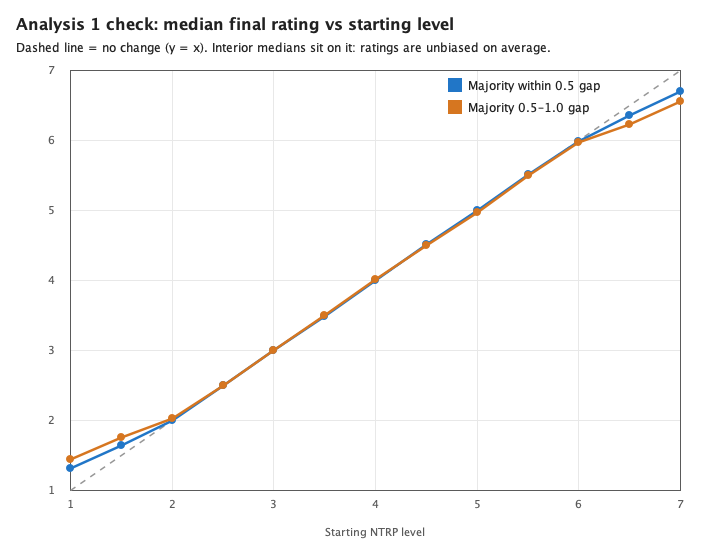
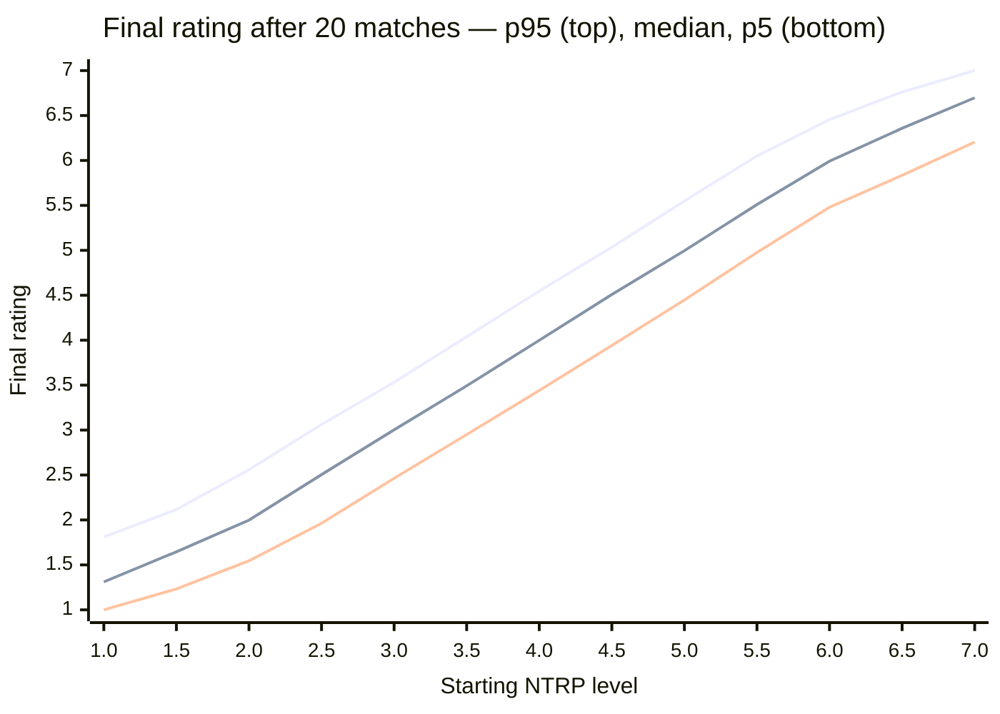
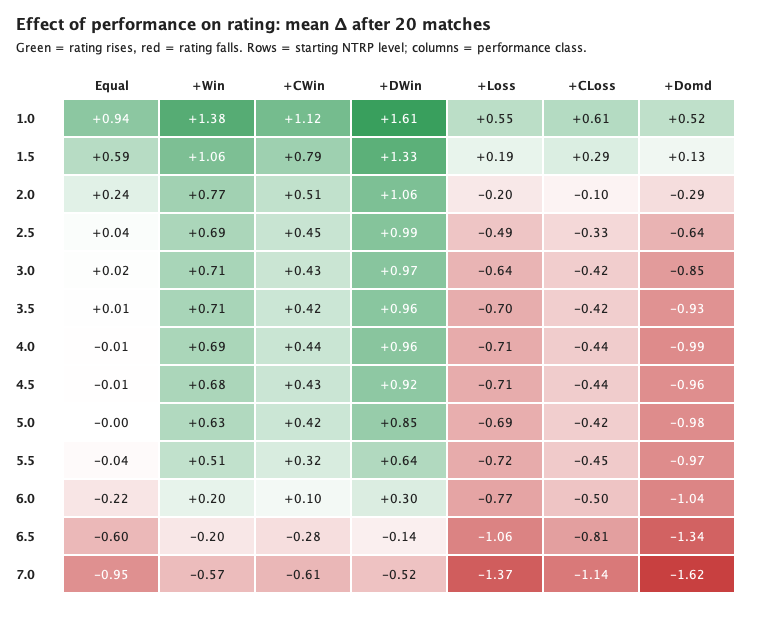

# NTRP Rating Simulation Studies

Two report programs exercise the production rating calculator
(`PerformanceBasedRankingCalculatorImpl`) to characterise its behaviour — one
deterministic, one probabilistic. This document summarises their findings, then
discusses the K-factor and where a configurable K-factor parameter should live.

Both programs live in the test source set and reuse the real calculator (no
re-implementation of the maths). They write fixed-width text plus Markdown and
PNG artifacts into `presentations/` (git-ignored); regenerate with:

```bash
./gradlew generateMatchupReport      # NtrpMatchupMatrixReport  -> presentations/ntrp_matchup_matrix.*
./gradlew generateMonteCarloReport   # NtrpMonteCarloReport     -> presentations/ntrp_montecarlo.*
```

All numbers below were produced with the production constant **K = 0.16**
(seed `20260624`, 3 000 simulated players × 20 matches for the Monte Carlo study).

---

## Study 1 — Matchup matrix (deterministic verification)

`NtrpMatchupMatrixReport` enumerates **every** ordered pairing of the 13 NTRP
levels (1.0–7.0 in 0.5 steps) crossed with **every** legal single-set score, with
P1 always the winner. Each cell shows `P1's delta / P2's delta` and is checked
against the master formula computed independently from first principles:

```
change = K × dominance × scale × sign      (then clamped to the 1.0–7.0 bounds)
```

**Result: 0 cells out of tolerance** (±1e-4) — the calculator matches the formula
exactly across all 1 000+ matchups. The study confirms four behaviours:

**1. Change scales linearly with dominance (game margin).** For evenly-rated
players (gap 0), the winner's gain is exactly `K × dominance`:

| Score | Dominance | Equal-player change |
|---|---|---|
| 6-0 | 1.000 | ±0.160 |
| 6-1 | 0.714 | ±0.114 |
| 6-2 | 0.500 | ±0.080 |
| 6-3 | 0.333 | ±0.053 |
| 6-4 | 0.200 | ±0.032 |
| 7-5 | 0.167 | ±0.027 |
| 7-6 | 0.077 | ±0.012 |

**2. Expected wins earn nothing.** The competitive threshold is 8.3% of the range
(0.5 rating points). A favorite must be essentially level with the opponent to
gain anything — even beating the *adjacent* level (gap 0.5, i.e. exactly at the
threshold) yields **0.000**. Beating anyone further away also yields 0.

**3. Upsets are rewarded, and doubled.** When the lower-rated player wins, the
change is amplified by `gap / threshold × 2`. Example (score 6-0, gap 1.0):

| Direction | Matchup | Winner's change |
|---|---|---|
| Favorite wins (expected) | 2.0 beats 1.0 | **0.000** |
| Upset (underdog wins) | 1.0 beats 2.0 | **+0.643** |

**4. Boundary clamping is explicit.** At the 1.0 floor and 7.0 ceiling the change
is clipped so a rating never leaves the range, intentionally breaking the
otherwise strict zero-sum (these cells are flagged `*` in the report).

---

## Study 2 — Monte Carlo (probabilistic behaviour)

`NtrpMonteCarloReport` simulates a player's rating evolving over 20 randomized
matches, running every match through the real calculator. It has two analyses.

### Analysis 1 — gap-driven scenarios

Opponents are drawn near the player and the outcome is derived from the rating
gap (the favorite wins more often and dominates more often). Two opponent mixes
are compared: *majority within a 0.5 gap* and *majority 0.5–1.0 away*. The two
are nearly identical; the within-0.5 distribution of the final rating:

| Start | Mean | SD | p5 | Median | p95 |
|---|---|---|---|---|---|
| 1.0 | 1.344 | 0.253 | 1.000 | 1.311 | 1.811 |
| 2.0 | 2.020 | 0.310 | 1.546 | 1.998 | 2.559 |
| 3.0 | 3.000 | 0.333 | 2.464 | 3.003 | 3.532 |
| 4.0 | 4.000 | 0.338 | 3.441 | 3.999 | 4.547 |
| 5.0 | 4.997 | 0.333 | 4.448 | 4.996 | 5.549 |
| 6.0 | 5.980 | 0.304 | 5.479 | 5.992 | 6.455 |
| 7.0 | 6.663 | 0.253 | 6.204 | 6.697 | 7.000 |

**Findings — in line with expectations:**

- **Unbiased on average.** In the interior the median final rating equals the
  starting level — the rating is a martingale under balanced, gap-driven play.
- **Bounded uncertainty.** The p5–p95 band is ~±0.5 wide (SD ≈ 0.33) after 20
  matches.
- **Boundary regression.** Near 1.0 and 7.0 the distribution is pulled inward
  (1.0 → median 1.31, 7.0 → median 6.70) because the floor/ceiling clamp losses
  at the bottom and gains at the top, and edge players mostly play "into" the range.



The median (both opponent mixes) sits on the dashed `y = x` "no change" line through
the interior — unbiased on average — and only bends inward at the 1.0 / 7.0 ends.
The Mermaid chart below adds the p5–p95 band (the within-0.5 scenario) that the
median-only view omits:



### Analysis 2 — outcome-class experiment

Here the opponent gap is held neutral (uniform 0–1.0) and the **per-match outcome
mix is fixed by a class**, isolating each performance pattern's effect. Classes:
*Equal*, *more wins* (`+Win`), *more competitive wins* (`+CWin`), *more dominant
wins* (`+DWin`), *more losses* (`+Loss`), *more competitive losses* (`+CLoss`),
*more dominated* (`+Domd`).



Green cells raise the rating, red cells lower it; the colour intensity is the size
of the move. The full numeric values (all 13 levels) follow.

Mean rating change (Δ) after 20 matches, by starting level × class:

| Start | Equal | +Win | +CWin | +DWin | +Loss | +CLoss | +Domd |
|---|---|---|---|---|---|---|---|
| 1.0 | +0.941 | +1.381 | +1.123 | +1.613 | +0.553 | +0.608 | +0.523 |
| 2.0 | +0.243 | +0.769 | +0.505 | +1.060 | -0.199 | -0.099 | -0.292 |
| 4.0 | -0.011 | +0.693 | +0.438 | +0.965 | -0.710 | -0.435 | -0.988 |
| 6.0 | -0.220 | +0.195 | +0.097 | +0.296 | -0.770 | -0.503 | -1.038 |
| 7.0 | -0.947 | -0.568 | -0.615 | -0.516 | -1.375 | -1.135 | -1.623 |

At a glance (🟩 rating rises · ⬜ ~unchanged · 🟥 rating falls; doubled = strong move):

| Start | Equal | +Win | +CWin | +DWin | +Loss | +CLoss | +Domd |
|---|---|---|---|---|---|---|---|
| **1.0** | 🟩🟩 | 🟩🟩 | 🟩🟩 | 🟩🟩 | 🟩 | 🟩🟩 | 🟩 |
| **2.0** | 🟩 | 🟩🟩 | 🟩 | 🟩🟩 | 🟥 | ⬜ | 🟥 |
| **4.0** | ⬜ | 🟩🟩 | 🟩 | 🟩🟩 | 🟥🟥 | 🟥 | 🟥🟥 |
| **6.0** | 🟥 | 🟩 | ⬜ | 🟩 | 🟥🟥 | 🟥 | 🟥🟥 |
| **7.0** | 🟥🟥 | 🟥 | 🟥🟥 | 🟥 | 🟥🟥 | 🟥🟥 | 🟥🟥 |

**Findings — in line with expectations:**

- **Winning raises, losing lowers**, and **bigger margins move the rating more**:
  in the interior the ordering is `+DWin > +Win > +CWin` (and the mirror
  `+Domd > +Loss > +CLoss`). Dominant wins move a rating ~2× faster than
  competitive wins.
- **Win/loss effects are symmetric** in the interior (at 4.0, `+DWin ≈ -(+Domd)`,
  `+Win ≈ -(+Loss)`, `+CWin ≈ -(+CLoss)`).
- **Boundaries override performance.** At 1.0 every class trends up (the floor
  clamps losses; edge players play up); at 7.0 every class trends down. The flip
  happens around 2.0 at the bottom and 6.5 at the top.

---

## K-factor sensitivity: 0.16 vs 0.016

K is a **pure linear gain** on every match's rating change, so reducing it 10×
makes each step 10× smaller. The simulations were re-run with K = 0.016 (the
calculator constant temporarily overridden, then reverted — not committed).

**The qualitative structure is identical** — same sign pattern, same ordering
(`+DWin > +Win > +CWin`), same symmetry, same "expected wins earn nothing". Only
the magnitudes change.

**Analysis 1 (distribution after 20 matches):**

| Start | Median K=0.16 | Median K=0.016 | SD K=0.16 | SD K=0.016 |
|---|---|---|---|---|
| 1.0 | 1.311 | **1.026** | 0.253 | **0.027** |
| 4.0 | 3.999 | 4.000 | 0.338 | **0.034** |
| 7.0 | 6.697 | **6.975** | 0.253 | **0.028** |

- Spread is **~10× tighter** (SD 0.33 → 0.033) — players barely leave their start.
- **Boundary regression nearly vanishes**: with tiny steps a player can't travel
  far enough in 20 matches to feel the 1.0 / 7.0 walls.

**Analysis 2 (mean Δ after 20 matches, at start 4.0):**

| Class | K=0.16 | K=0.016 | ratio |
|---|---|---|---|
| +DWin | +0.965 | +0.096 | ~10× |
| +Win | +0.693 | +0.069 | ~10× |
| +CWin | +0.438 | +0.042 | ~10× |
| +Loss | -0.710 | -0.071 | ~10× |
| +Domd | -0.988 | -0.097 | ~10× |

The interior is almost exactly linear in K. Near the boundaries the ratio is well
below 10× (e.g. 7.0 `+Domd` is −1.62 vs −0.26) because the K=0.16 run hits the
floor and gets clamped while the K=0.016 run never gets close.

### Conclusions

- **K trades responsiveness for stability.** At K=0.16 a strong performer gains
  nearly a full NTRP level (+0.96) in ~20 matches; at K=0.016 the same gain takes
  **~200 matches**. Convergence time scales like `1/K`.
- **K=0.16** converges within a season (~20 matches) but is comparatively
  volatile — a single result moves a rating noticeably, and the boundaries pull
  hard.
- **K=0.016** is very stable and low-churn, but **laggy**: a genuinely improving
  or declining player — or a mis-set initial rating — self-corrects ~10× slower,
  and over a 20-match season almost everyone stays pinned near their start.
- For a performance-based system that should reflect current form within a
  season, **0.16 is the more appropriate default**; 0.016 would suit a context
  that prizes long-term stability over responsiveness. An intermediate value
  (e.g. ~0.05) is worth evaluating if 0.16 feels too volatile in production.

---

## Where should a configurable K-factor live?

The studies above required overriding K. That is currently a hard-coded constant
(`K_FACTOR_NTRP = "0.16"`), which has an important property: **K is fixed per
build**. A given git SHA / deployed artifact always computed ratings with exactly
the K visible in its source, so any historical rating is fully accountable from
the code. The per-calculation audit trail already records the K used
(`"kFactor" to ratingScale.toStringPrecise()`), and combined with an in-source
constant that audit entry is anchored to a specific, reviewable build.

**Requirement: keep this auditability while allowing reports to sweep K.**

### Rejected: external/app-wide configuration

Putting K in an **environment variable**, `application.yaml`, or a DB config row
breaks the audit trail: the same build could compute ratings with different K
values over time, the value could change without a code review or a new build,
and reconstructing "what K produced this stored rating?" would require external
operational logs rather than the code itself. For a number that defines the
rating semantics, that provenance gap is unacceptable.

### Recommended: a calculator parameter with an in-code default

Make K a **parameter of the calculator** whose default is bound to the in-source
production constant:

```kotlin
class PerformanceBasedRankingCalculatorImpl(
    private val kFactorNtrp: BigDecimal = K_FACTOR_NTRP,   // production default lives in code
) : RankingCalculator {
    companion object {
        // The production K-factor. Changing it is a code change -> PR -> new build -> new git SHA.
        private val K_FACTOR_NTRP = "0.16".bd
    }
    // ...uses kFactorNtrp instead of the constant directly
}
```

- **Production** constructs the calculator with no argument, so it uses the
  in-code default. The value still lives in source and is traceable to a build;
  changing it goes through code review and git history — the audit trail.
- **Reports and tests** pass an explicit value
  (`PerformanceBasedRankingCalculatorImpl(kFactorNtrp = "0.016".bd)`) to sweep K
  dynamically, with zero effect on the production path.
- The existing per-calculation `kFactor` audit entry stays meaningful and now
  reflects exactly the parameter that was supplied.

This is deliberately **not** wired to any environment or runtime configuration:
the dynamic capability exists only at the constructor boundary for offline
analysis, while production keeps a single, build-pinned, in-source value.

> Note: this also composes with the algorithm-versioning convention
> (`service/calculator/impl/v1/`). If K ever needs to change for production, doing
> it as a code change against a new algorithm version gives a clean, auditable
> before/after boundary for any rating recalculation.
